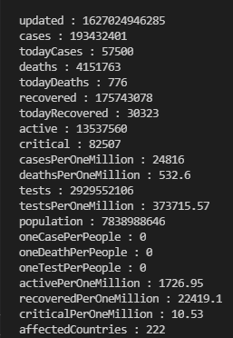

# Covid 19 Tracker

## AIM
To show all kinds of updates reagrding covid 19 cases. ```The data gets updated after every 10 minutes```

## Purpose
To get useful information regarding the records of covid 19 cases from [disease.sh](https://disease.sh/v3/covid-19/all) API, like:
 - Total Number of cases till now.
 - Total Number of cases today
 - Total Number of Deaths Today.
 - Total Active cases
 - Total Critical cases 
 <br>
 and many more ...

 ## Short Description
 This project is made to get the updates of covid 19 cases around the world and the records get updated after every 10 minutes, with this project one can easily understand how to use APIs for your project.

 ## Outputs
 