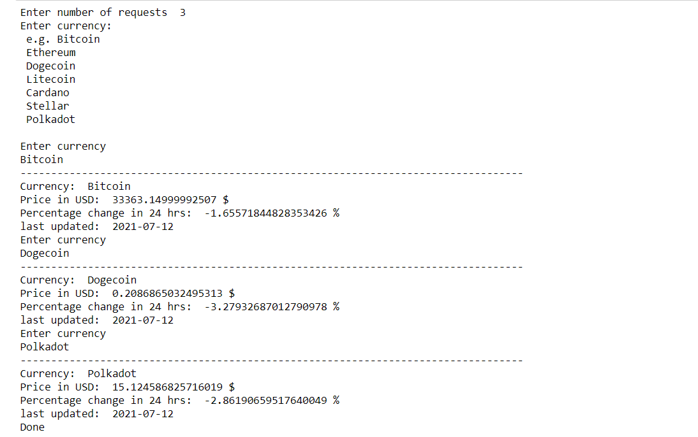

# Detect Language API 🗣

## 🔹Introduction
<ul>
  <li>This project allows you to fetch latest rate of cryptocurrency in USD, and percentage change in 24 hours, with time when the rates are updated last.</li>
</ul>

## 🔹Purpose
<ul>
  <li>User can fetch latest rates of cryptocurrencies and percentage change in 24 </li>
  <li>User can detect language type of his data in .txt format files</li>
  <li>It is mini version of language detector on your local machine</li>
</ul>

## 🔹Requirements
<ul>
  <li>requests</li>
</ul>
  
    

### Example API Request: 
### 'https://cryptantapi.root.sx/getPrice/Bitcoin'

<br>

# Setup Instructions

1. Have Python 3.x setup in the system
2. Install the necessary packages 
3. Run the code using the command

    ```
      python cryptocurrency_rates.py
    ```
   and obtain the Output

<br> 

# Workflow of the Program

1. Enter number of requests
2. Enter currency name
5. Obtain the Output

<br> 

# Output




## 🔹Author
   Drashti Patel
