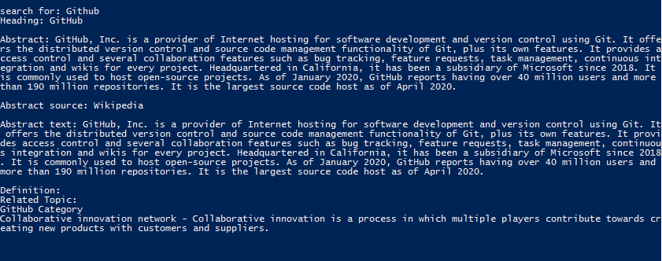

# DuckDuckGo it

## Aim

The main aim of the project is to search something without opening a browser.

## Purpose

This project is using DuckDuckGo API which will return search result without using browser.

## Short description of package/script

- API used is DuckDuckGo api https://duckduckgo.com/api.
- requests module is used for extracting data.
- It is a standalone script which will give search result.

## Workflow of the Project

First search term is taken from user and then it is searched by api after that Heading, Abstract, AbstractSource, AbstractText, Definition 
and two Related Topic are shown as result.

## Setup instructions

Install Python Install all requirements by pip install -r requirements.py  
Run python duckduckgo_it.py

## Output

## Conclusion

This project will return the search result without opening browser.

## Author(s)

Atharva Bhandvalkar  
You can connect with me at : https://www.github.com/a-tharva
