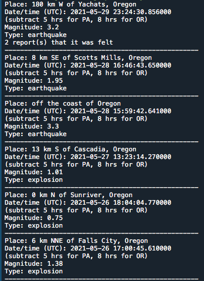

# Earthquakes.py 

The Earthquakes.py program displays information about earthquakes registered in Oregon and Pennsylvania in the past seven days. (I chose these two states because that’s where our family lives.) You could easily change the code to display earthquakes in other states. The information comes from an API provided by the [U.S. Geological Survey] (https://www.usgs.gov/products/data-and-tools/apis).

# Output

Output is printed to the console, as shown in this example:

