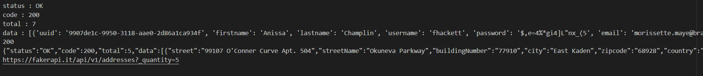
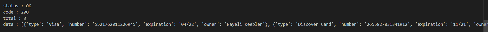
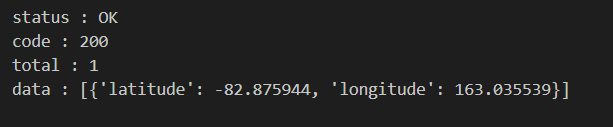
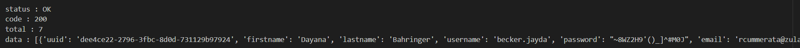

# Faker API (Fake Data Generator)

## AIM
To randomly generate fake data for further application

## Purpose
To generate fake data for Data Science purposes or testing purposes [FAKER API](https://fakerapi.it/en)  
We can generate fake data related to:
 - Address , which includes the street address , city , district, pincode ,etc.
 - People , whether male or female , with the inclusion of first name , last name , email id ,etc.
 - Credit Card Information , all the factors related to credit cards , like card no . , cvv,card holder name ,etc.
 - Location , which includes the latitude and longitude of the location
 - Companies : with their name , email address,contact no , location , etc.
 <br>
 and many more ...

## Short description of package/script
 Libraries used in this project are:<br>
  - ```requests```:- To get an API call from the website. <br>
  - ```json```:- To convert the json data that we got from API to python data.
  - ```fakerapi```:- To call in the Faker package to generate fake data

## Workflow of the Project
This project follows the following steps:<br>
 - Importing relevant libraries
 - Making an API call
 - Converting json data to python data
 - Accessing the python data to show the records.

## Setup Instructions
In order to run this code in your system, one needs to make sure that relevant libraries are installed, use the following commands for installation:
 - ```pip install requests```<br>
 - ```pip install json```

## Outputs
<br>
Request call getting 200 means API call successfull 
<br>
Fake Address Generation eg 
<br>
Fake credit card details generated 

Fake location generation
<br>
Fake People generation 
<br>


## Author
 [Shiwansh Raj](https://github.com/photon149)
