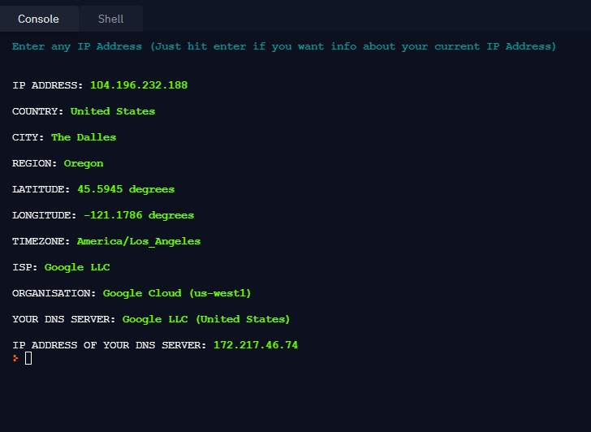
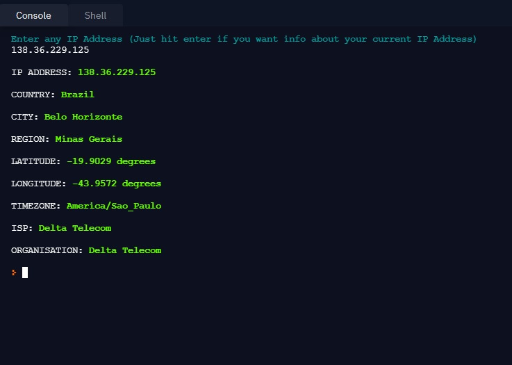
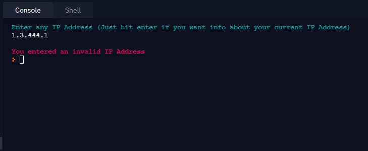

# IP-Address API

**Description :** A simple python program that generates information about a particular IP Address with the help of 'ip-api.com' API ( No API Key required )

**Imported modules:**
- requests
- simple_colors

**Website URL** : https://ip-api.com/

**API Documentation URL** : https://ip-api.com/docs

---
## Output Images

---

---

## Author:
Debashish Kundu

You can connect with me at : https://www.github.com/its-me-debk007
