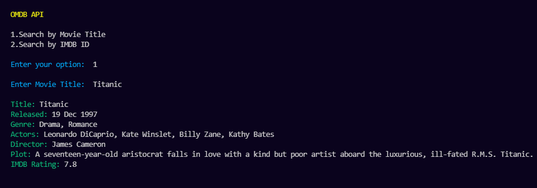
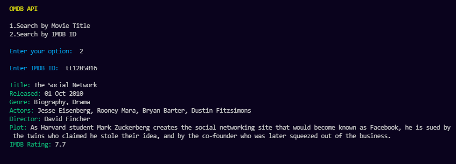

# MOVIE SCRIPT - OMDB API

The Open Movie Database(OMDB) API is a RESTful web service to obtain movie information.
<br>
The API offers methods for searching content including movie or TV show titles by episodes and more. 

The API supports 
- Search by Movie Title 
- Search by IMDB ID

The API supports both JSON and XML data formats. 
 
### Source  
### http://www.omdbapi.com/  

### Example API Request: 
### http://www.omdbapi.com/?apikey=[yourkey]&

<br>

# Setup Instructions

1. Have Python 3.x setup in the system
2. Create an account with the API provider
3. Get the API Key and replace < your-api-key > in the code 
4. Run the code using the command

    ```
      python omdb_api.py
    ```
5. Enter the required input and obtain the Output

<br>

# Output



