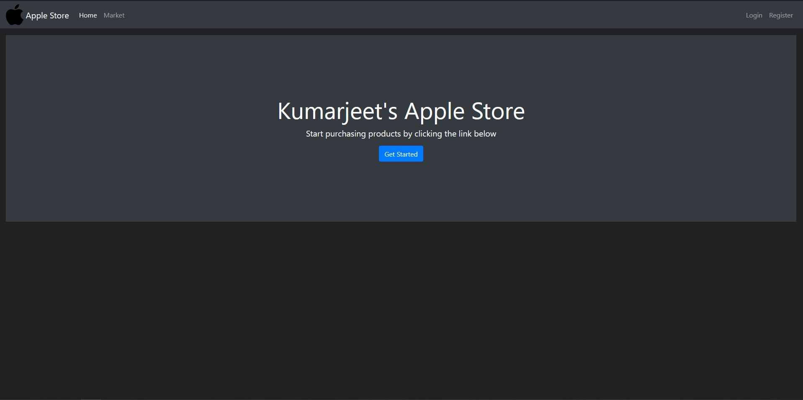
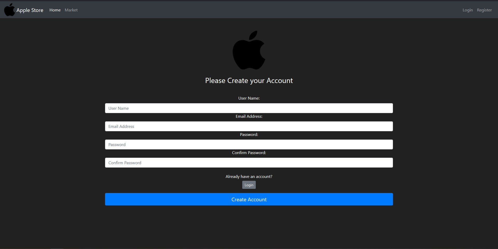
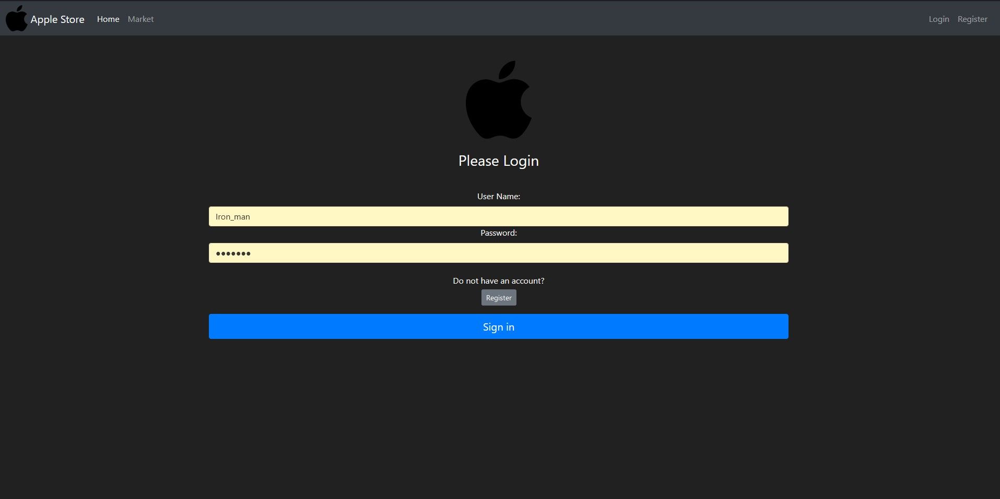
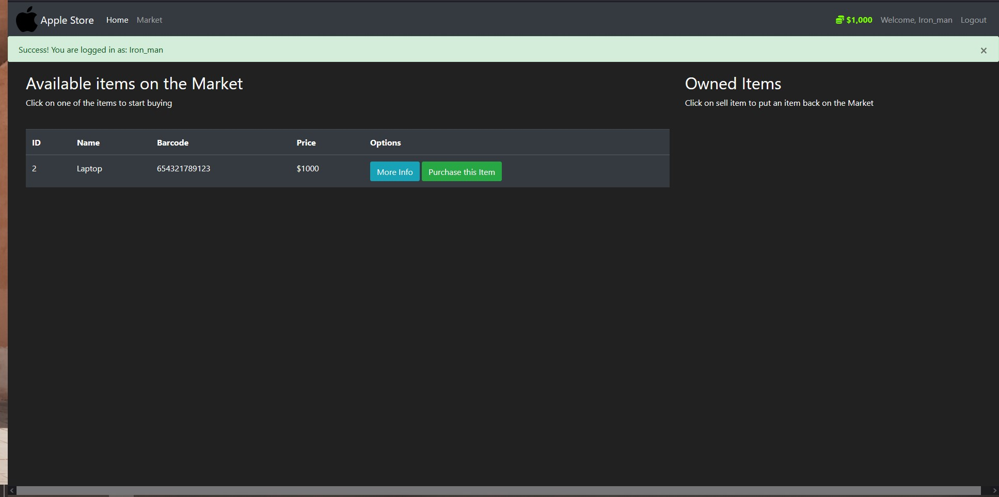
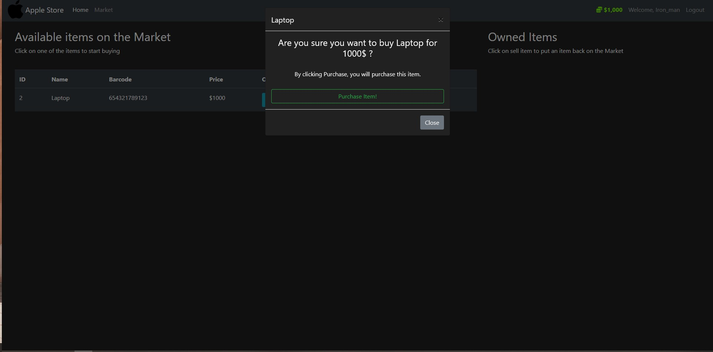
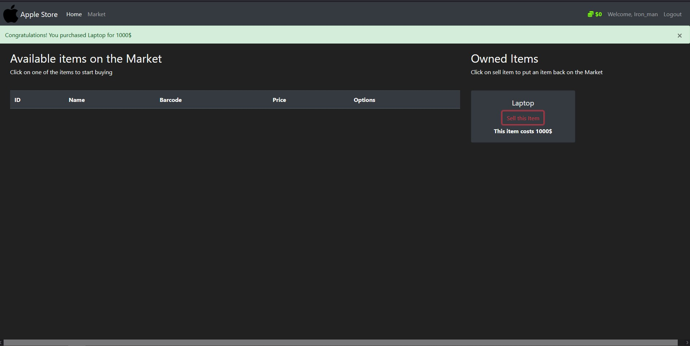

# Package/Script Name: Apple Store

## Short description of package/script

- A full stack website for buying and selling items
- It is implemented using Flask and SqlAlchemy

## Setup instructions

- Need to install both SqlAlchemy and Flask through the terminal
- Then use set FLASK_APP=run
- flask run

## Detailed explanation of script, if needed
- The script is divided into many parts
- First is the market package
	- It contains the python files __init__, forms, models and routes
		- The __init__ file initializes the databse, the login users and password bcrypt 
		- The forms is used for creating the user login, registration, buying and selling forms
		- The models is used for creating the classes of tables present in the databse, password and email verification and the budget
		- The routes is used for routing the user to different pages
	- It also contains various html files like base, home, login, market, register and a directory containing the html files items_modals and owned_items_modals
		- The base file contains the base proforma of the website, which the rest of the webpages extends
		- The home file is used for designing the home page
		- The login file is used for designing the login page
		- The register file is used for designing the register page
		- The market file is used for designing the market page
		- The item_modals and owned_items_modals contains the design of the buying and selling part
	- The run file is used to run the entire program 

## Output

## Author(s)

Kumarjeet Ray

## Disclaimers, if any

N/A
