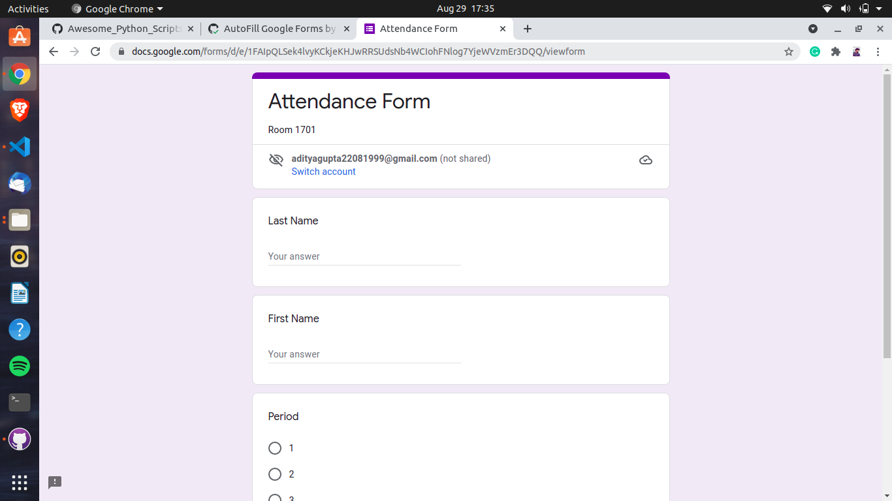
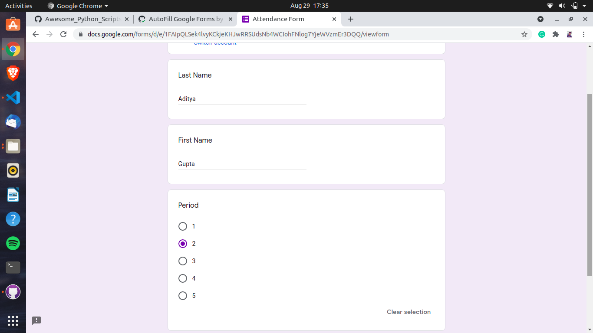
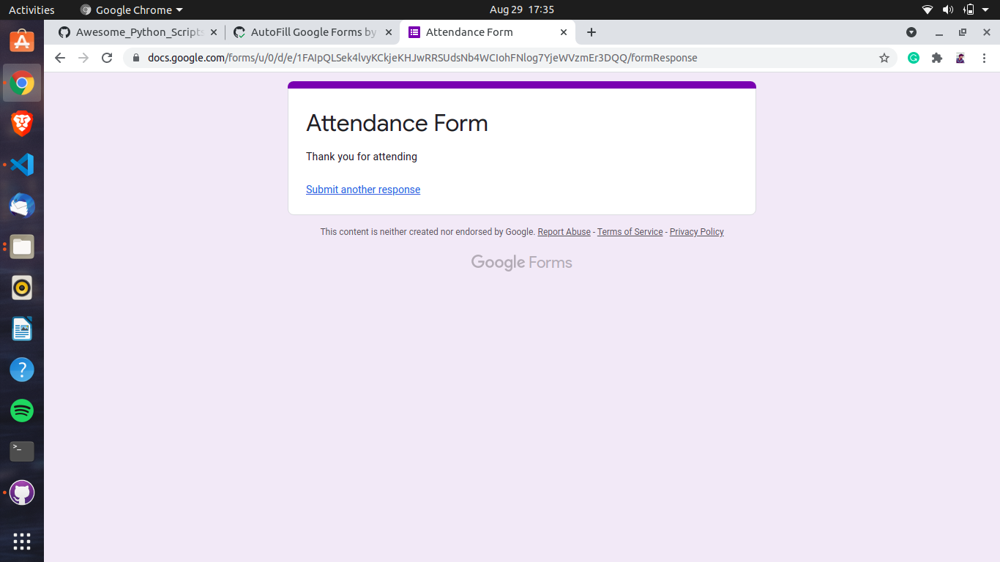

# ✔ AUTOFILL GOOGLE FORM
- ### We will look at Web Automation using Python in detail. We will be using the Webdriver and Selenium Libraries to do our coding, and we will be filling out an attendance form.
- ### Auto fill in your form using your saved information.
- ### This will Reduce your time in filling the form.

****

# REQUIREMENTS :
- ### python 3
- ### Selenium
- ### Webdriver

****
# SCREENSHOTS :
****

   
  
After 3 sec the form will be filled automatically

   
   
Google form will be also Submit automatically

   

# Purpose :
- ### This scripts helps user to easily to fill Form automatically.

# Compilation Steps :
- ### Install Selenium, Webdriver, webbrowser.
- ### Note that this script works only on chrome broweser v-93
- ### You can change code according to your need
****

# Name : 
- ### Aditya Gupta
