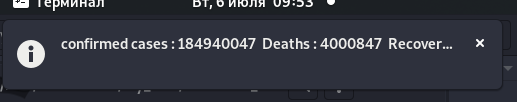

# Covid Cases Bot

# Changes Done
1. Add module notify2, it is necessary to display notifications in nix systems.
2. Add module platform to determine the OS.
3. Added count and timeout variables for convenience.
4. Add module math for the possibility of continuous iteration.
5. Data printing in the console window is removed.

# Output

# Added functions:
- To work in windows 'covidbot_Windows'

- To work in Linux 'covidbot_Linux'

# For continuous operation, the covidbot function is called by the count=math.inf parameter

# Author
DelionA
