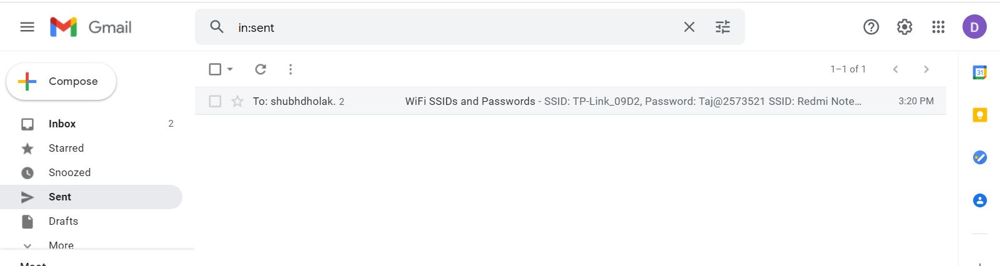
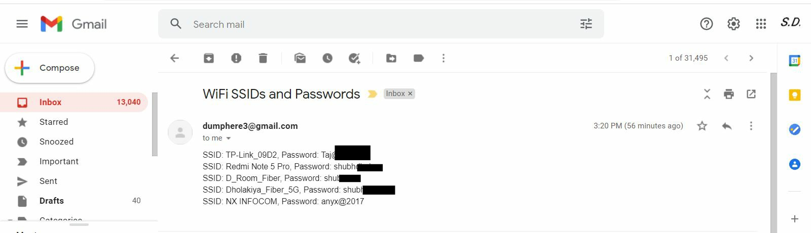

# Generate WiFi Password and Send to Specified Email Address

### - Basically this program extracts all the passwords of all the WiFi that is currently connected and all previous connected WiFi. 
### - It collects names of all the WiFi as in SSIDs and their passwords and sends them to the Specified email address.

* Note: The sender's email address must set to allow less secure apps, if you are using Gmail.

# Output

## Author(s)

Shubh Dholakiya
