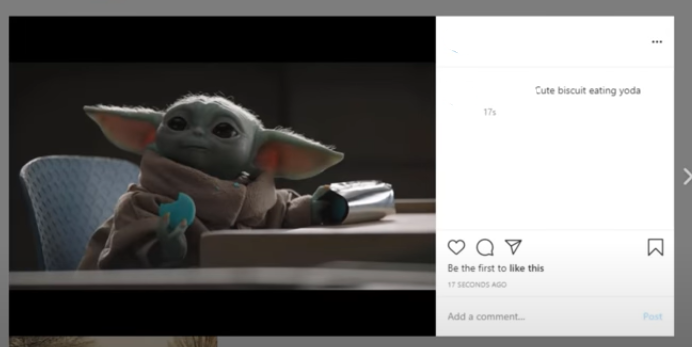
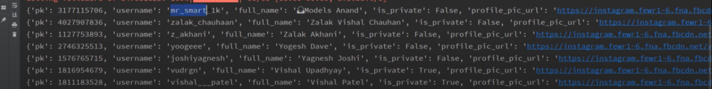

# Instagram Bot

## Short description of package/script

Here in the script we had used instabot library and perform 6 features 1>we logged in instagram ,2>followed another account, 3>upload a post , 4> created a group chat , 5>getting the followers list and 6>unfollowing all the followers.
- List out the libraries imported -> instabot. 

## Setup instructions

Here for setup we just need to have a instagram account id and password and then give it in the script and then we can do any of the task. 

## Output

## Author(s)

Neel Shah
