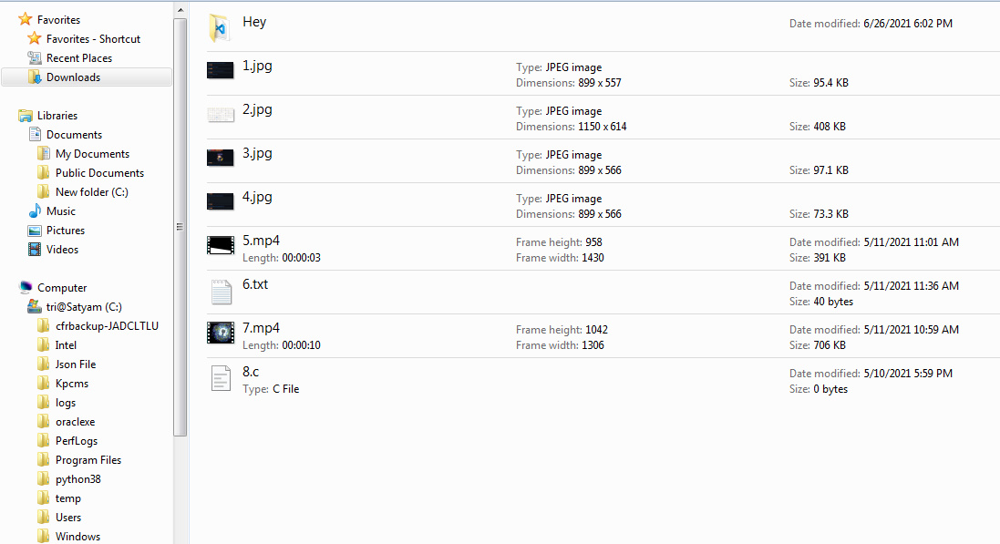
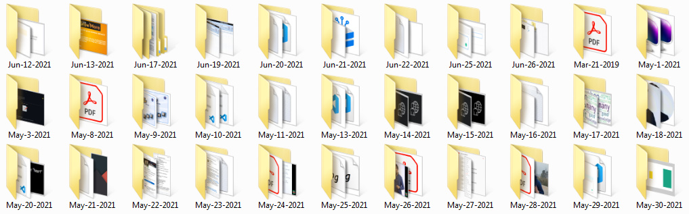

We will try to build a Python script that would move all of your files to new directories based on their creation and modification dates. Basically, it will look for directories, and, if any are found, it will extract all of the files from that folder, delete that folder, and then arrange them by creation date.
 ### Follow the below steps: 
- Import the following modules
```python
import os
import time
import shutil
import datetime
import glob
```
- To change the directory and move to the directory where you wish to place all your files based on the modification date, use the os.chdir function.
- To list all the folders and files, use the os.listdir function.
- To get the current working directory, use the os.getcwd method.
- Run a loop to go over all of the files within and outside the directories.
- For storing all of the file instances, use the glob.glob function.
- We may simply move files from one location to another by using the shutil.move method.
- After removing the files from the folder, use the shutil.rmtree methods to remove the folder.
- Then, one by one, extract the Year, Month, and Day.
- Run an If condition to see if that folder has already been created; if not, create it using the file's creation date as the name.
- Finally, using the shutil.move function, move all of the files one by one to the newly formed folder.

## Output 1: 

## Output 2: 

