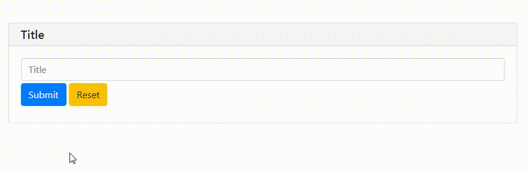
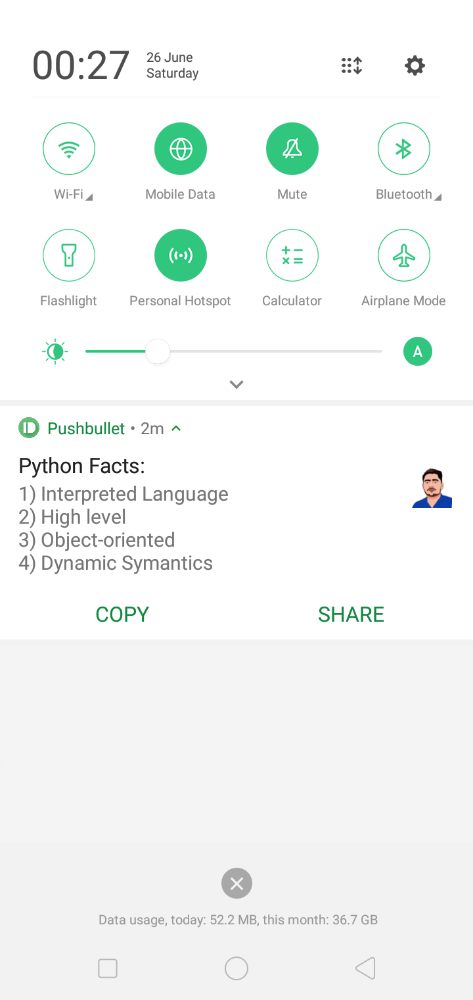

We'll look at how we can send push notifications to our phones with a simple click. For reporting, Pushbullet, a popular Python tool, will be utilised. For this, we'll need to login in to your computer and phone as well as establish an account on Pushbullet.com.

#### Let's begin applying this script once we've set up the account on both devices.
- Install the following modules listed below
```python
pip install pushbullet.py==0.9.1
pip install pywebio
```
- Import the following modules
```python
from pushbullet import PushBullet
from pywebio.input import *
from pywebio.output import *
from pywebio.session import *
import time
```
- Go to Pushbullet and obtain the access token.
- Get your Access Token and use the PushBullet method to create an instance.
- Use the push_note function to send data and text inside the function.



