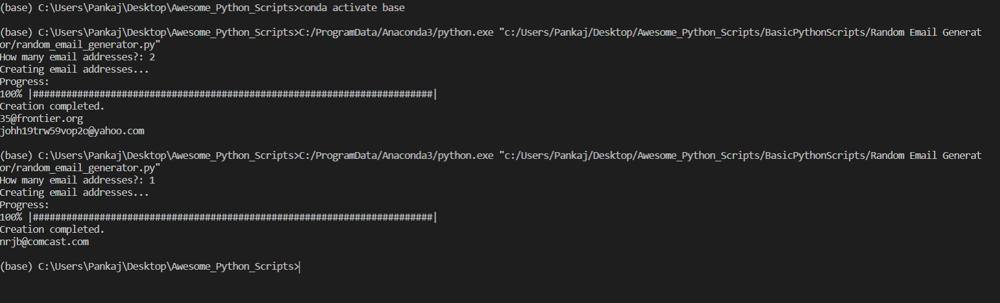

# This is a Python Script which generates random email addresses with domains based on user input
 
## Libraries used:
- Random
- CSV
- Progressbar
- String


## Requirements

## For this script to run install requirements file

```python
 pip install -r requirements.txt
```
## Run the program using command

``` 
$ python random_email_generator.py
```
## Output 


Contributed by [Pankaj]('https://github.com/pankaj892')