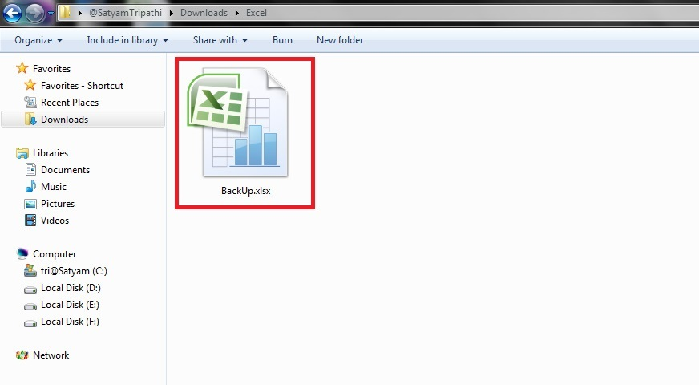
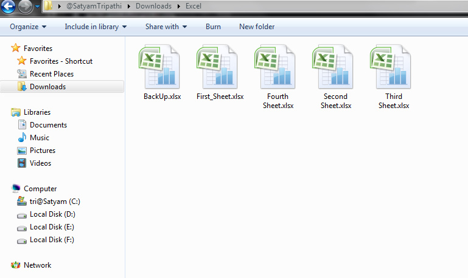

In this file, we'll look at how to divide Excel sheets into distinct Excel files. We all know how crucial Excel sheets are today for holding large data packets. We will divide the sheets using the xlwings package, which is defined in Python. We will first copy all of the sheets and then try to convert them into individual Excel files.

Let's have a look at the process step by step:

- Install the module given below
```pytho
pip install xlwings
```
- Import the following modules
```python
import xlwings as xw
import os 
```
- Create a new excel instance with xlwings.App, then set visibility to 'False' if you don't want the excel window to appear. Then, using the books.open function, open the worksheet.
- We'll now execute a loop to traverse through each sheet.
- Using the api.copy method, copy each sheet to a new workbook.
- After that, before saving the new worksheet, be sure you activate it.
- We will now use the sheet names as file names.
- At last, we'll shut our workbook.
- Finally: when you exit the excel sheet, you will notice that all of the sheets have been changed to new excel files.



