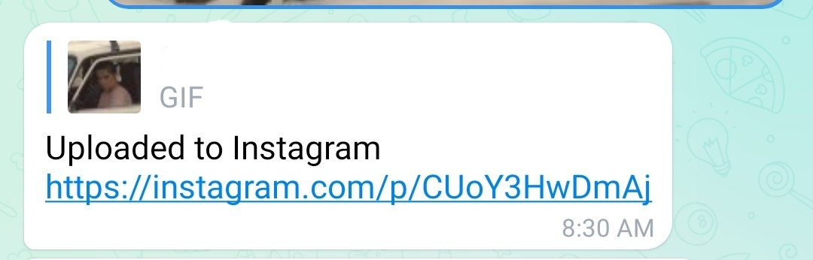

# Telegram Instagram Uploader

## Aim
Automation/simplification for Humans 🤷‍♂🤖

## Purpose

To Allow Telegram Users, to easily Upload Videos saved on Telegram to Instagram Reels.

### Libraries Used
- `Telethon` : for connecting with Telegram
- `Instagrapi` : for connecting with Instagram
- `Cryptg` : Optional Requirement of Telethon, to speed up download process..
- `moviepy` : required by Instagrapi, for video processing...

## Workflow of the Project
- When You send your Video/gif to chat filled in `TG_CHATIDS`.
- Bot will download that Video to its local.
- And will try to Upload Video to Instagram Reels from Account whose credentials are filed in `INSTAGRAM_USERNAME` and `INSTAGRAM_PASSWORD`.
- And Done! 
- `settings.json` will be created to save Instagram Login Settings, to avoid Multiple Logins.
- Similarly, Telethon creates a `.session` file to save the auth.

## Setup instructions
- Just You need is Install [`python`](https://www.python.org) on your device.

## Compilation Steps
- Check and fill the Required Values in `telegram_instagram.py`
- Install Requirements
   - `pip3 install -r requirements.txt`
- Run the main Script
   - `python3 telegram_instagram.py`

## Output
### AT TELEGRAM

#### AT INSTAGRAM

## Author(s)
- [New-dev0](https://github.com/New-dev0)
