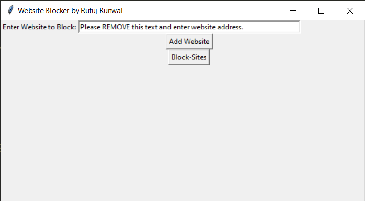
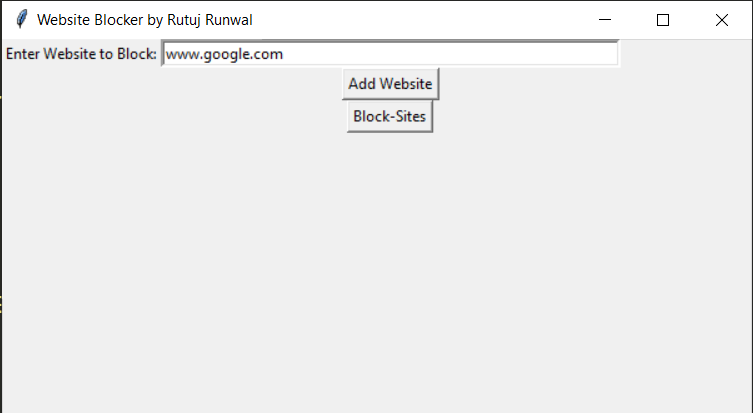
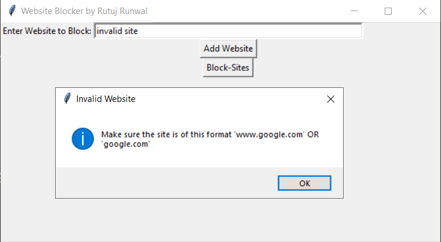

# 
 Website Blocker using PC Hosts files 

## Introduction: 
This is a script that aims to implement a website blocking utility for Windows-based systems. It makes use of the computer's hosts files and runs it as a background process, preventing access to the sites entered by the user in list format.
## Third-party libraries required:
The project does not require any third party libraries

## Running the Script:
After opening the script in your Python IDE, execute the code so that you get the UI output window. Open your browser and try to visit the websites you blocked. When the script runs successfully, you will see `This site can't be reached` error or similar 404 error's on the browser.

**Note:**
> In some systems, access to the computers's hosts files maybe denied by default to prevent malware attacks. So the script while executing may show an error while modifying the hosts files. 
> Please visit [here](https://www.technipages.com/windows-access-denied-when-modifying-hosts-or-lmhosts-file) for a brief readup on how to solve the issue.

> *Recommended:* Please revert to the original access settings after testing the script to prevent any future compromise

## Output:
#### The output UI will appear as shown below:

#### You can add new site as shown below then click on "Add Website" button.You can add as many as you want:

#### If you entered anything that's not a proper website. An error will show up to guide you:

#### Once you are done with adding websites, you can click on Block-Sites button to begin blocking