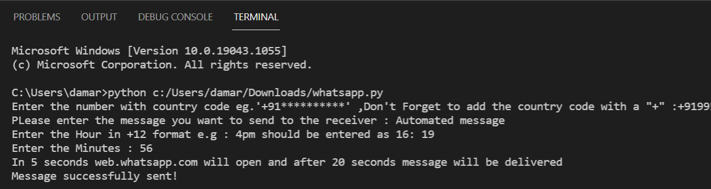
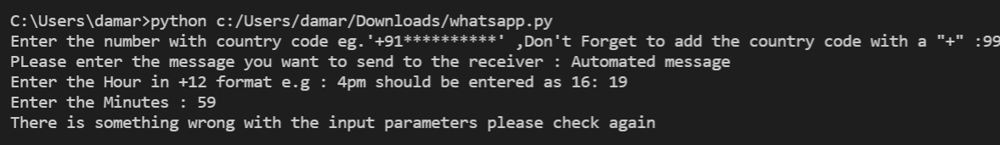
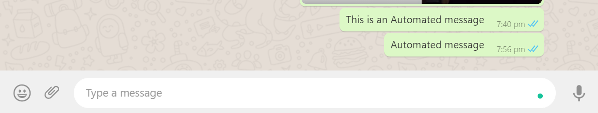

## WhatsApp Automation using python

- This is a script which is used for sending an automated WhatsApp message.

### About the Script

It takes 4 parameters as input:

- phone number of the receiver
- message to be sent to the receiver
- Time at which the message should be sent in hours
- Time at which the message should be sent in minutes

### Setup instructions

1. Install Python 3.x (recommended) from <a href="https://www.python.org/downloads/">here</a>
2. Download this repository as zip and extract.
3. Use Python IDLE or PyCharm to run the program.
4. Run the code and start taking input as Row and Column. 
5. Have fun!!

### Screenshot of the Output

### Screenshot for exception caught

### Screenshot of the message in whatsapp

### Author

[Damarla Venkata Sai Chandana](https://github.com/chandu6111)
