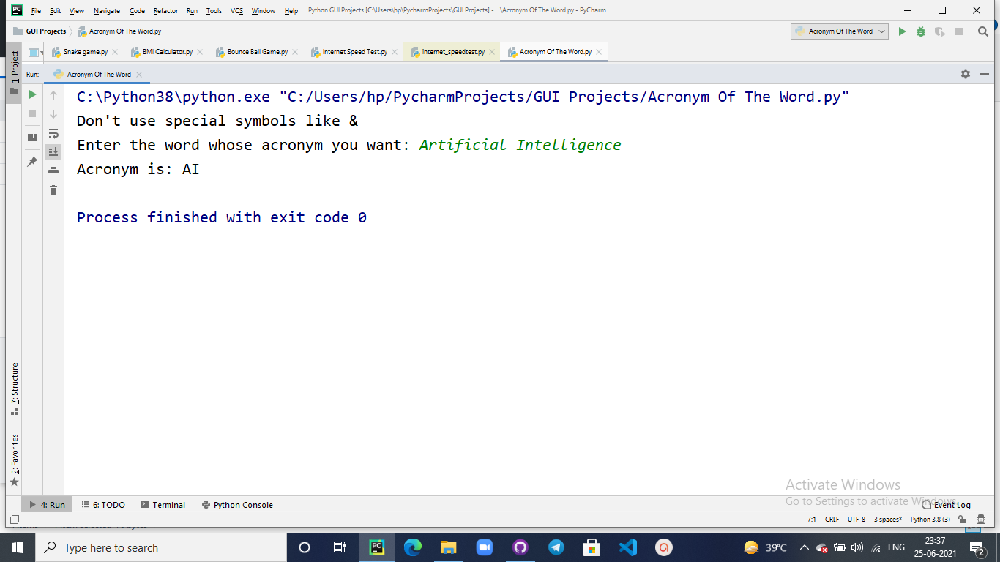

## Acronym Of The Word 

# Purpose:
This basic python script is used to help the user to easily get the acronym or short-form of the word entered by him/her.

# Short Description:
This code is used to give you the acronym of the words you entered i.e; the initials of the words entered by you.
Eg: If user enters Artificial Intelligence then the output will be AI.
Some special symbols like "&" should not be used for better reults.

List Of Libraries Imported:
It is a basic Python Script so there is no need to import any sort of Python libraries, the only thing the user has to do is give the input properly.

# Workflow:
In this code the user has to run the program and make a single input of the word he/she wants to get the acronym, the remaining function is of the program to give the initial of the words entered by user. It is recommended that the user should not use symbols like "&" for the perfect results.

# Output:

# Author
Khushi Sharma
