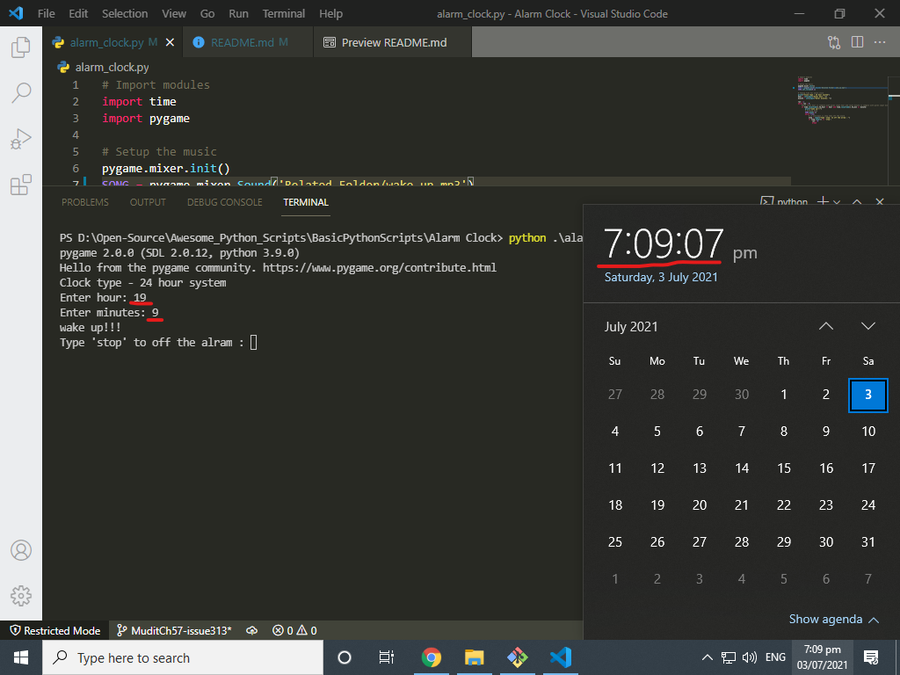

# Alarm clock

## Description of the script
This alarm clock has been made with python. It takes time to set the alram and play the song to wake up you.
#### Libraries used
- pygame
- time

## How to setup locally?
- First install the python on your machine **if not installed**. [Download Python](https://www.python.org/downloads/)
- Install required modules. Type/Paste this ```pip install -r requirements.txt```
- Click on the **alarm_clock.py** file to use this script.

## Output

## Authors
- Pratima Kushwaha
- Mudit
