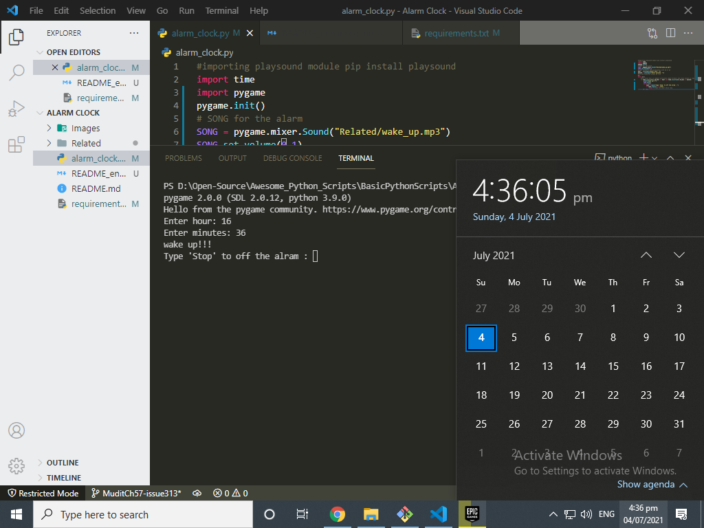

# Alarm Clock

# Changes Done
1. Remove amPm variable that takes input for am and pm. Because alram clock is based on 24 hour system no need for am and pm.
2. Add pygame to play music because the second while loop (which takes input to off the alarm) doesn't run because the interpreter execute playsound first but this not the case with pygame(because plays in the background and user can give input too)
3. Imroved name of local variables.
4. Add a variable that takes input to off the alarm music.

# Output

# Author
Mudit Choudhary