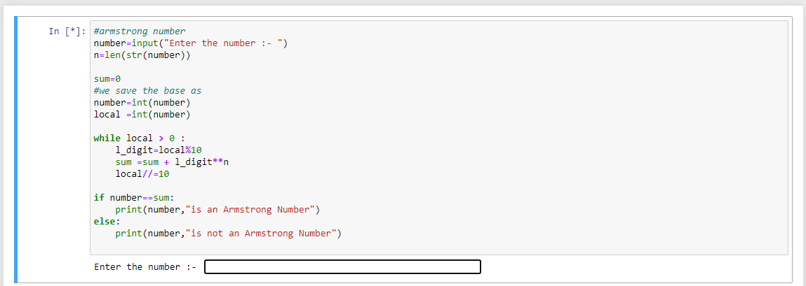
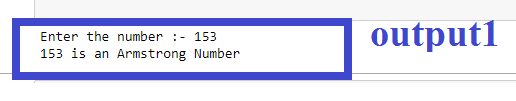
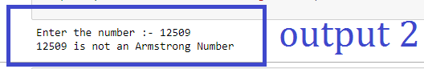

# ARMSTRONG NUMBER
It is a program where we play with armstrong numbers

## _Title_:
  To check whether the number is an armstrong number or not.
 
## _What_it_is_ ?
Armstrong number (aka Narcissistic number) of length N digits is a number which is equal to the sum of its digits each in power of N.
For example: 153 = 1^3 + 5^3 + 3^3 = 3 + 125 + 27 = 153

## _Description_:
  Here, the user enter a random number and the program will tell that the entered number is armstrong or not. 
  
## _Workflow Steps _: 

1.) Firstly, the program demands a numerical value from the user.

2.) Now, it will check the conditions passing through loops.

    a.)Storing the value in a temporary variable called local.

    b.)Checking the square of each digit in the number and storing it in sum variable.
    
    c.)Using if else to check whether the value stored in variable sum is equal to number or not.
    
3.) Printing the results according to the loop it entered.    
  

## _Compilation Steps_:
1.) Run this program in a proper IDE e.g. Pycharm, VScode ,Jupyter notebook etc or any Online compiler like Repelit.

2.) Enter the number you want to check.

3.) The output will show you the desired result.

## _Screenshot_:      
### _Code_:

### Output :

## _For any query contact_:

linkedIn : www.linkedin.com/in/PRai

_** Author**_
 
 Priyanshi Rai
