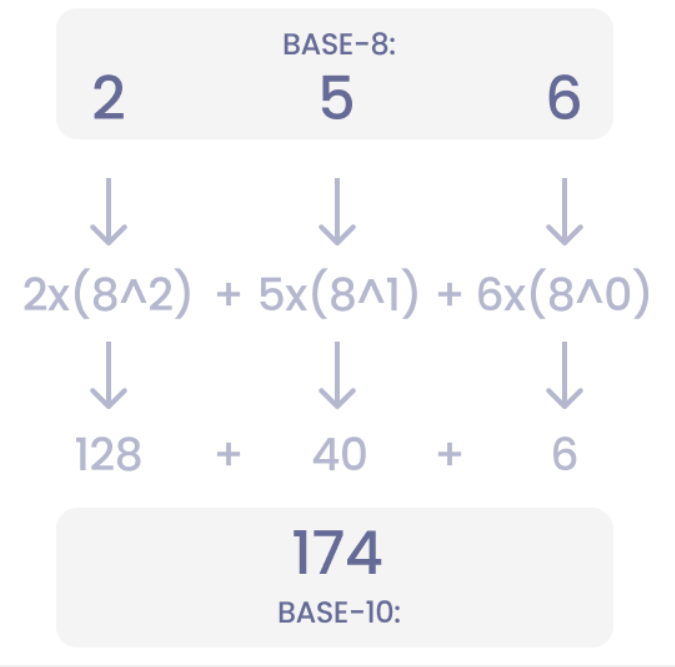
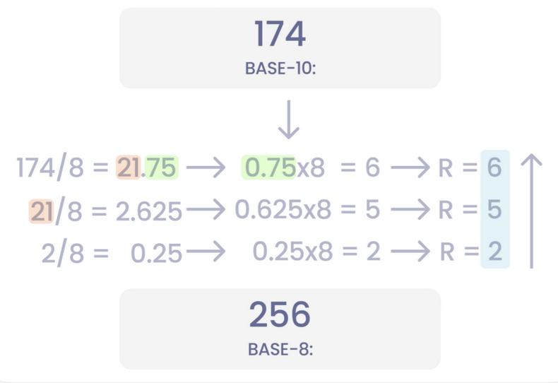
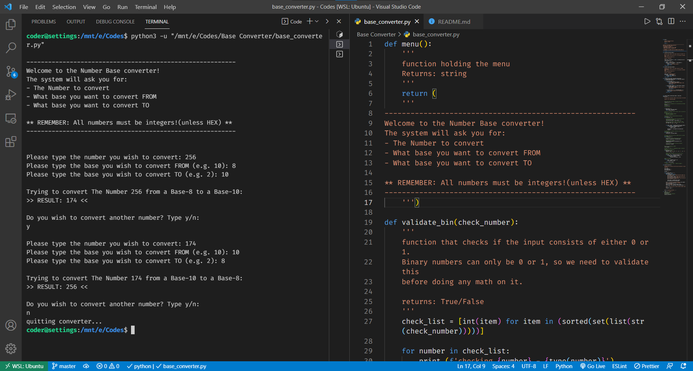

# Title:-

Base Converter

## Aim :- 
We build a calculator which can convert any number from any base to any other base. In number systems, “Base” tells us how many numbers you have available. Binary has 2, octal has 8, decimal has 10 etc.

## Purpose :- 
A program which can handle any number and base we give it. It could be save a lot of time when we want to change one base to another.

## Short Description :-

simple python script to Base convert (Binary, decimal, hexadecimal & Octal etc.) to (Desired base (i.e. Binary, decimal, hexadecimal & Octal).

## Setup instructions :-
  For script to work you must have python3 installed in your system.
  To run the script
  ```
  python3 -u "base_converter.py"  
  ```
  
## Detailed explanation:- 
<em>Converting From One Base to Another : </em>
The first conversion we should look at is going from any base (Base-N) to the decimal system(Base-10). It is very easy to convert from The decimal system to any other base. Therefore, it is valuable to know how to get to the decimal system.

If we keep using decimal and octal as examples, we can convert a number in the octal system to its equivalent in the decimal system. <br>
The way we do this is that we take each number and multiply it with the base powered by the position index (num * (base^position)). If we start from the lowest number to the right, we multiply 6 with 8⁰, 5 with 8¹ and 2 with 8².
An illustration that will make this a lot easier to understand:
  <p align = "center">
  
  </p>
  When we have the number in the decimal system (Base-10) it is really easy to go to any system. Let’s go back from 174 (Base-10) to 256 (Base-8).
We find the number in another base is by dividing it with the base and keep the remainder. The remainders will construct the number in the other base for us. When we have the remainders, we read the number from the least significant number to the most significant number, meaning from bottom to top. There you have your new number represented in your new base! ‍
  <p align = "center">
  
  </p>

Not only does this mean we can go from Base-10 to Base-8 and vice versa. We can go from Base-X to Base-Y. Any Base we want.

This program covers several aspects of programming. First, we need to find the problem. The problem is that it takes a lot of time to manually convert all the numbers.
Then we find/learn the math to solve the problem and find what’s common. As it turns out, we can convert anything to anything with the same formula. We only need to handle binary and hexadecimal input and we need to make sure we don’t try to calculate Base-1. This means we can use functions to handle our code.


## Output:-
  <p align = "center">
  
  </p>
  
## Author(s):-
  [Vaibhav Vipin](http://github.com/Vaibhav-Vipin)
