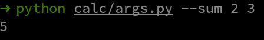

# CLI Calculator

## Aim

Calculator via CLI made with Python built-in Argparser


## Purpose

Learn tests and Python Argparser


## Short description of package/script

To run CLI Calculator execute:

- `python calc/args.py --help` - For help
- `python calc/args.py --sum x y` - To sum two numbers
- `python calc/args.py --sub x y` - To subtract  two numbers
- `python calc/args.py --mult x y` - To multiply two numbers
- `python calc/args.py --div x y` - To divide two numbers


To run tests execute:
```shell
python -m unittest discover tests
```


## Workflow of the Project

You can execute `python calc/args.py --help` to check all available commands


## Setup instructions

This project is using a Python built-in library, no external package is needed


## Compilation Steps

This project doesn't need to be compiled.


## Output

**Sum function**


**Help**


## Conclusion

This project helped me to know new functionalities of Python and understand the unittest skeleton


## Author(s)

Willian Lopes


## Disclaimers, if any

Use this section to mention if any particular disclaimer is required
