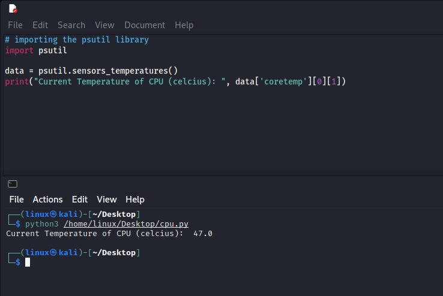

# Title:-

CPU Temperature

## Description :-

This is a simple python script to calculate CPU Temperature, which is compatible with Linux based Operating System. For the running this script make sure you have python install along with library "psutil".

## Setup instructions :-

You can install the all requirements from **requirements.txt** by using pip.

```
pip install -r requirements.txt

python3 "cpu.py"

```

## Output:-

  <p align = "center">
  
  </p>
  
## Author(s):-
  [Vaibhav Vipin](http://github.com/Vaibhav-Vipin)
