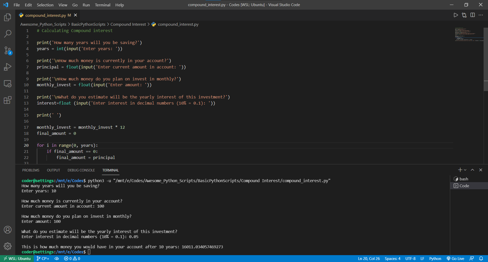

# Title:-
  Compound Interest

## Short Description :-
  A simple python script to calculate Compound Interest

## Setup instructions :- 
  For script to work you need to have python3 installed in your system. <br>
  To run the script
  ```
  python3 -u "compound_interest.py"
  
  ```
## Detailed explanation :- 
  compound_interest.py is very simple program which helps a user to caculate CI/an yearly estimated interest & save their time. After knowing how many years they will be saving, their account balance, amount they want to invest, and yearly interest of the ivestment.

## Output:- 
  <p align = "center">
  
  </p>
  
## Author(s):-
  [Vaibhav Vipin](http://github.com/Vaibhav-Vipin)
