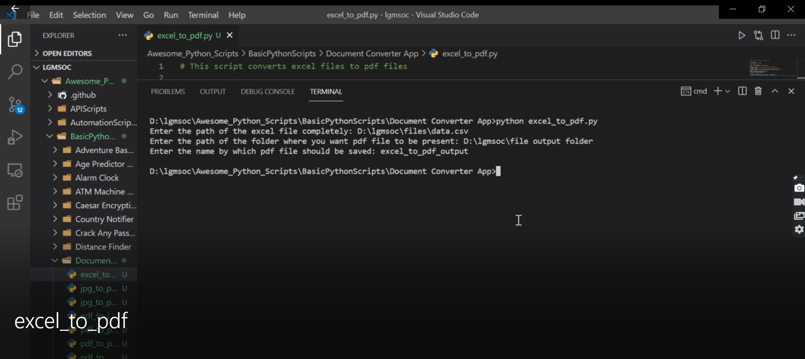
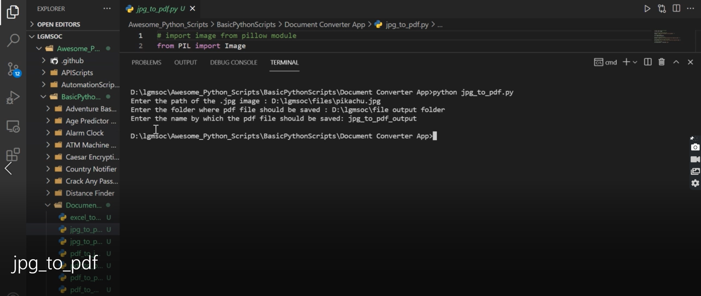
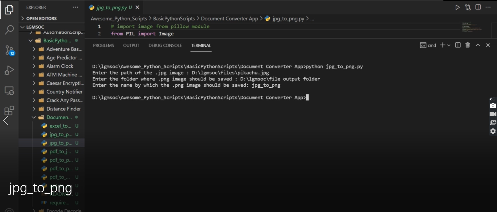
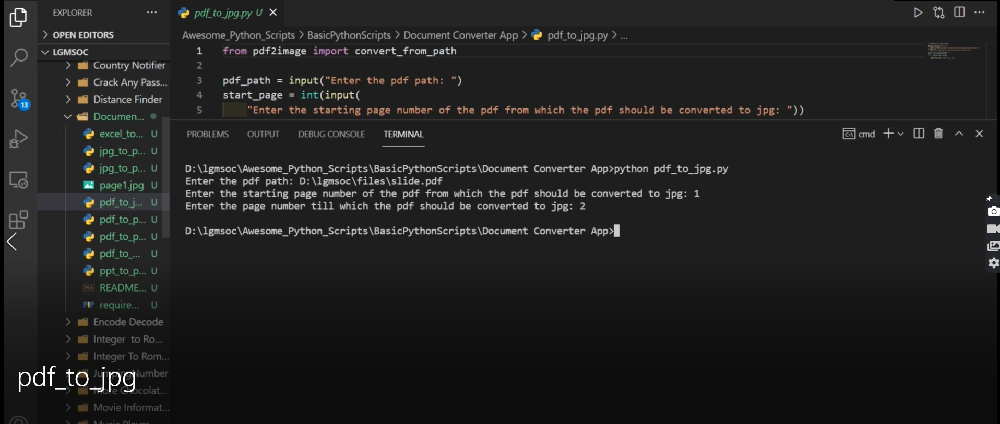
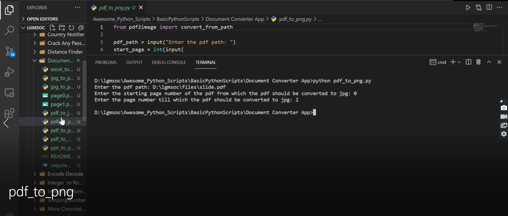
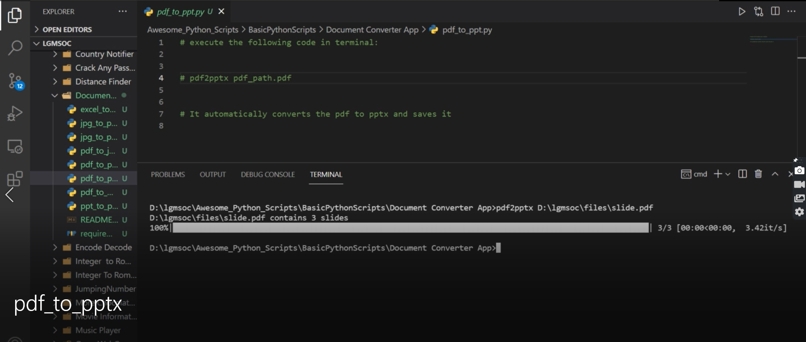
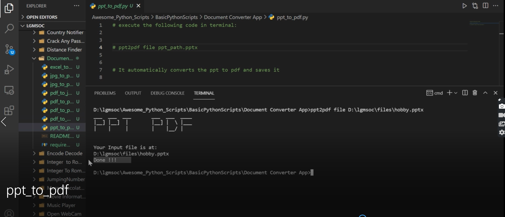

## Document converter using python

- This is a script which is used for converting files from one extension to other (for example, to convert from jpg to pdf, pdf to word etc).

### About the Script

It takes 3 parameters as input:

- path where the file to be converted, is stored(source_path).
- path where the converted file has to be saved(destination_path).
- the name by which the converted file has to be saved.
  (for example, if we are converting "test.jpg" to "test.pdf", the program takes the path where "test.jpg" is stored,then path where "test.pdf" has to be saved along with the name by which it should be saved(test)).

### Setup instructions

1. Install Python 3.x (recommended) from `<a href="https://www.python.org/downloads/">`here `</a>`
2. Download this repository as zip and extract.
3. Use Python IDLE or PyCharm to run the program.
4. Run the code and start taking input as Row and Column.`<br>`
5. Have fun!!

### Output Screenshots

**Excel to Pdf**

- [Code for conversion](excel_to_pdf.py)



**Jpg to Pdf**

- [Code for conversion](jpg_to_pdf.py)



**Jpg to Png**

- [Code for conversion](jpg_to_png.py)



**Pdf to Jpg**

- [Code for conversion](pdf_to_jpg.py)



**Pdf to Png**

- [Code for conversion](pdf_to_png.py)



**Pdf to Pptx**

Execute the following command in the terminal:

```
pdf2pptx pdf_path.pdf
```
- (Replace pdf_path by your file path)
 
 


**Ppt to Pdf**

Execute the following command in the terminal:

```
ppt2pdf file ppt_path.pptx
```
- (Replace ppt_path by your file-path)



### Author

[Damarla Venkata Sai Chandana](https://github.com/chandu6111)
