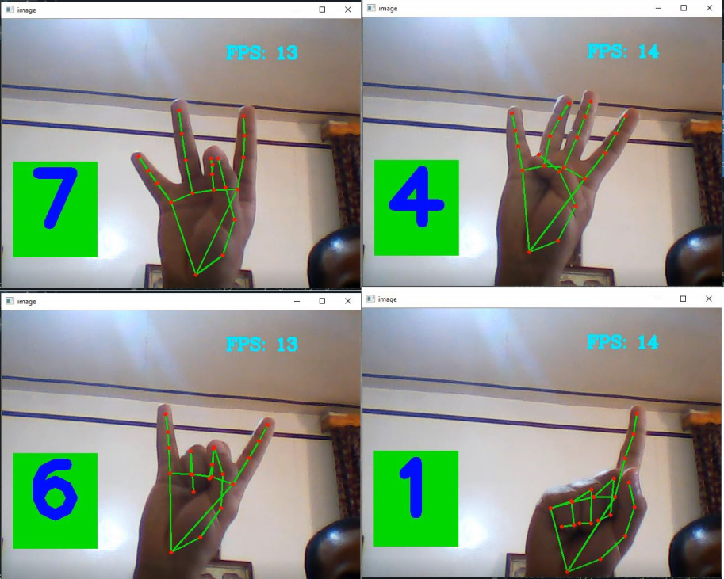

# Finger-Counter-using-Hand-Tracking-And-Open-cv
finger counting based on open-cv and hand tracking in real time

the important library :
- opencv-python
- mediapipe

the project detects the counting fingers for the right hand and count from (0-7)

# Screenshot

to run the project execute the fingerCountingProject.py script

