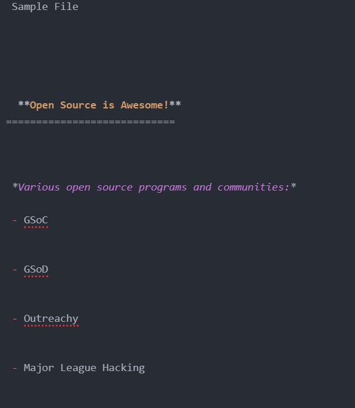

# Script Name

HTML to Markdown

## Short description of script

This script can be used to convert any file with HTML code into markdown(.md) format.

## Setup instructions

- Install the required packages by running the command `pip install -r requirements.txt`
- Download the script.
- To run the script use the command `python html_to_markdown.py`
- Enter the path of HTML i.e. the location where it is present on your local machine.
- The script will create a markdown file named `markdown_file.md` in the location where the script was present.

## Input and Output

- Sample HTML file

- Output markdown file

## Author(s)

[Tanvi Bugdani](https://github.com/tanvi355)
