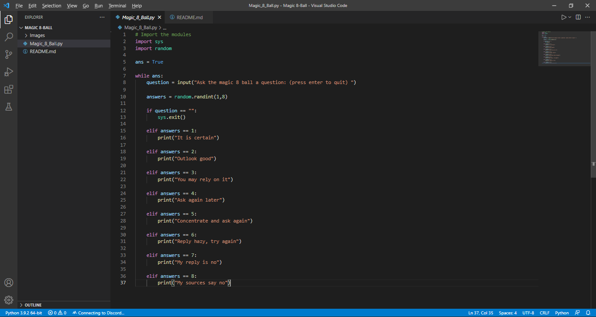
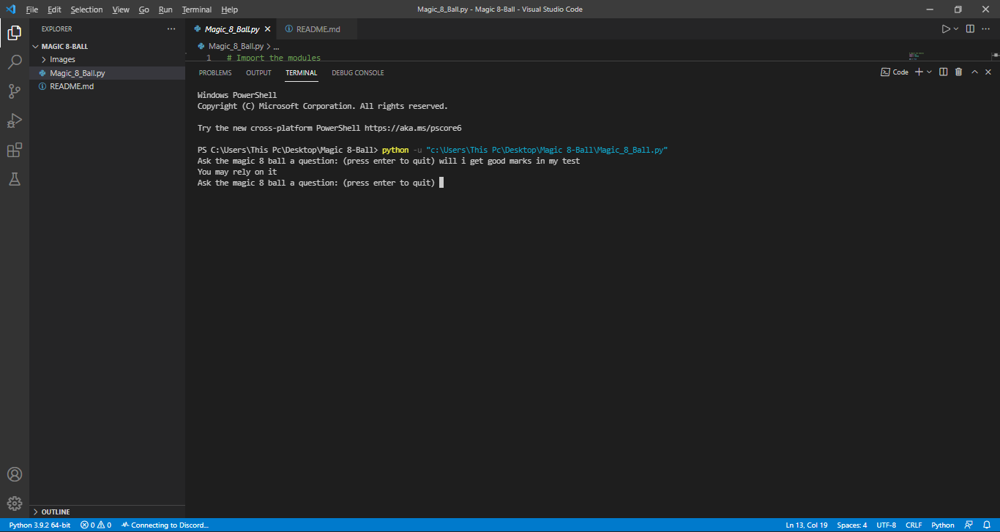

# MAGIC 8 BALL

## AIM
To generate random answers to questions asked to the Magic 8 Ball

## PURPOSE
The Magic 8 Ball is a toy used for fortune-telling or seeking advice.

## MODULES USED
Sys : The sys module in Python provides various functions and variables that are used to manipulate different parts of the Python runtime environment. It allows operating on the interpreter as it provides access to the variables and functions that interact strongly with the interpreter.

Random : This module implements pseudo-random number generators for various distributions.
For integers, there is uniform selection from a range. For sequences, there is uniform selection of a random element, a function to generate a random permutation of a list in-place, and a function for random sampling without replacement.

## WORKFLOW
- First of all, we would import sys and random modules from the python library
- Declare a boolean value(True) to ans variable
- Setup a while loop which works until the value remains True 
- Ask any random question to which we want answer
- Using randint func generate random a random number from 1-8
- Now using elif ladder, generate a random answer based on the question and print it

## SETUP INSTRUCTIONS
User needs a Python IDE to run the program

## OUTPUT

## AUTHOR
YASH KATARIA

## FOR ANY DOUBTS
www.linkedin.com/in/kataria-yash