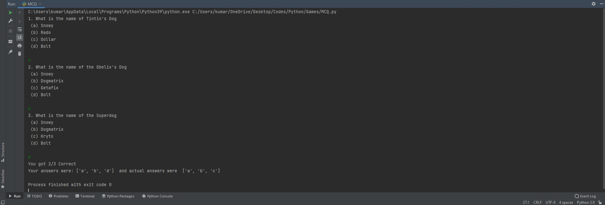

# Package/Script Name: MCQ

# Aim: To make a multiple choice question answering system.
# Purpose: Both for playing as well as quizes
## Short description of package/script

- For playing the game of MCQ one player is required.
- In case of one player the opponent is your PC

## Setup instructions

- Run the file in the python IDE
- 
## Workflow

- There is a class Question which stores the answers given by the player/user.
- There is a list pquestion_prompts which stores the questions and there is another list of questions which stores the questions along with their correct answers
- There is a run_test function which takes the inputs, compares the answers and calculates the result

## Output

## Author(s)

Kumarjeet Ray

## Disclaimers, if any

N/A
