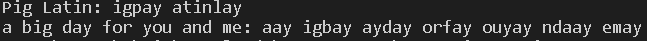
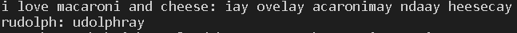

## Pig Latin Translator

## Aim

I want to be able to create a Python program that can translate a given english string to pig latin

### About the translator
- It's a basic python program which takes the user input and translates the string into pig latin

### How to execute?
- Just run the program and enter a string
- Result will be displayed as a new string with pig latin translation

### Workflow

1. Wrote rough draft algorithm
2. Created pull request for feedback
3. Got feedback and implemented
4. Checked if translating properly
5. Tweaked algorithm to do pig latin correctly and handle big test cases

### Setup instructions
1. Install Python 3 from PyCharm or other Python IDE
2. Download this repository as zip and extract.
3. Use PyCharm or other Python compiler to run this program
5. Run the code and try entering different strings

## Compilation Steps

1. When function gets string, it splits it by spaces to create a list of words
2. Loops through each word and converts it into pig latin
3. Puts words together and converts it into final string

### Output
 

### Author

Comnk

<table>
  <tr>
    <td align="center"><a href="https://github.com/comnk"> 
      <b>Comnk</b></a></td>
  </tr>
</table>

## Disclaimer

Program cannot handle giant strings, will need to fix algorithm to support larger strings
