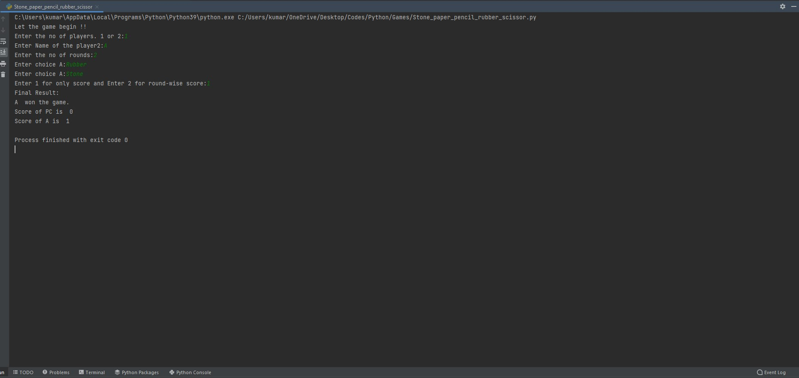

# Package/Script Name: Stone,paper,pencil,rubber and scissor

## Short description of package/script

- For playing the game of stone,paper,pencil,rubber and scissor either for one player or two players.
- In case of one player the opponent is your PC

## Setup instructions

- Run the file in the python IDE
- 
## Detailed explanation of script, if needed

- There is a class Player which store the name of the player, player number, calculates the score and stores the score round-wise. It even stores the choices made in every round
- There is another class PC which inherits the player class and does the same, just stores the player name as PC and number as 1
- It calculates the score both round wise along with choice and only the final one

## Output

## Author(s)

Kumarjeet Ray

## Disclaimers, if any

N/A
