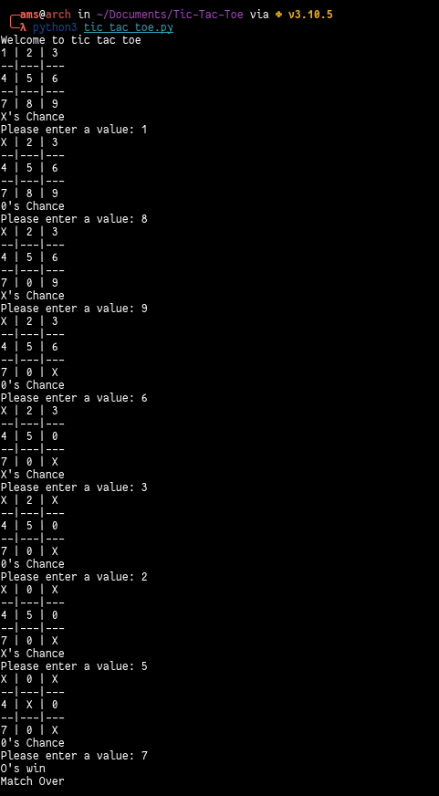

# Title
  Tic Tac Toe

## Short Description
  A simple python script to play tic-tac-toe

## Setup instructions
  For script to work you need to have python3 installed in your system. <br>
  To run the script
  ```
  python3 -u "tic_tac_toe.py"
  
  ```
## Detailed explanation
  Tic-tac-toe (American English), noughts and crosses (Commonwealth English), or Xs and Os (Irish English) is a paper-and-pencil game for two players who take turns marking the spaces in a three-by-three grid with X or O. The player who succeeds in placing three of their marks in a horizontal, vertical, or diagonal row is the winner. It is a solved game, with a forced draw assuming best play from both players.

## Output:- 
  <p align = "center">
  
  </p>
  
## Author(s):-
  [Arjun M S](http://github.com/arjun-ms)
