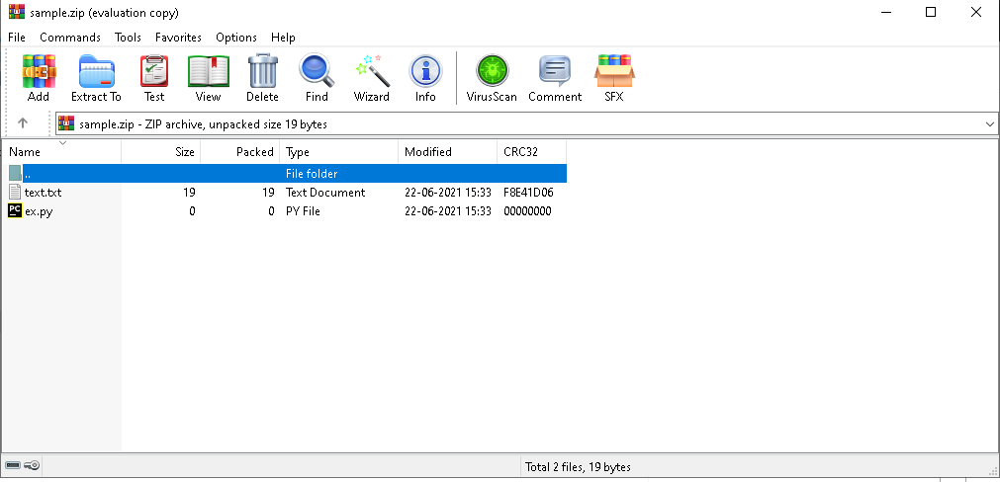

# Zip Files Extractor
## Short description of package/script
This is a python script which can help you to unzip the files which are ending with an extesion '.zip'.
Here we will use zipfile library and using that we will read and extract all the files in the same folder.

## List out the libraries imported
-> zipfile

## Setup instructions
We need to get the zip file in the same folder as of script and then just need to run so the script will read and extract all files in same folder.

## Output
Extracted file in same folder->

.png)

Sample zip file ->

## Author
Neel Shah
