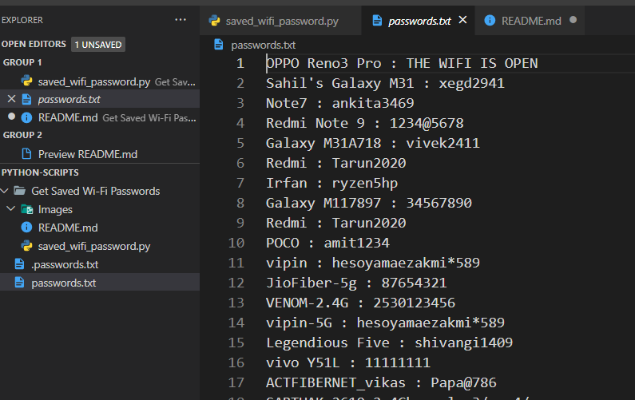

# Get Saved Wi-Fi Passwords

## Purpose

The purpose of this script is to get all the saved wi-fi to a text file.

## Short description of package/script

The Windows enviroment does not directly provide the saved Wi-Fi passwords on the system, but we can get the passwords using the command prompt using this feature we can call command prompt command through a python script and get multiple passwords within seconds.

## Workflow of the Project

- The project utilizes the subprocess built-in module to execute command prompt command from the python script
- The script also uses ReGex to get only the Wi-Fi profiles from the output of the subprocess.
- After getting all the Wi-Fi we need to execute the subprocess command once more to get password for each profile.
- If the Wi-Fi is not password protected the script will set its Password as Open.
- After getting all the password it is exported to a textfile.

## Setup instructions

- Open command prompt run `python saved_wifi_password.py`
- As soon as you run the script

## Compilation Steps

- Open the python script code in any of your ide.
- Follow the above mentioned Setup Instructions.

## Output

## Author

[Vivek](https://github.com/vivekthedev)
