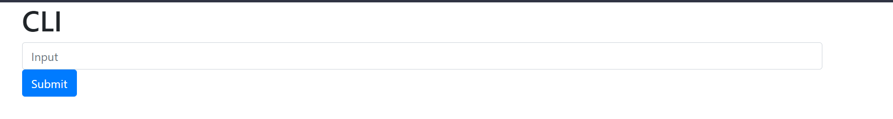

# Unsecure CLI

## Aim
For a learning opportunity about the importance of security and the consequences of bad security.   

## Description
This is a CLI (Command line interface) that works on a website. It is simple to set up and shows why the "eval" function in python should be used very wisely as to not accidently create a reverse shell.

## Setup
- You need to install flask using pip
```sh
   pip install flask    
```
- Then you are able to run the script using python
```sh
    python unsecure_cli.py
```
- This wil start a webserver with a website where the unsecure CLI is at. This is usually at localhost:5000

## Output
<p align="left">
  <br>
  <p>Website that shows the CLI</p>
</p>

## Author(s)
[Super02](https://github.com/Super02)

## Disclaimers
- Never use this script in any malicious way.
- The webserver that is started only runs locally and you need to do additional steps to make it run publically.
- Remember that all commands entered in the CLI are run. So do not enter anything you do not want to be run.
