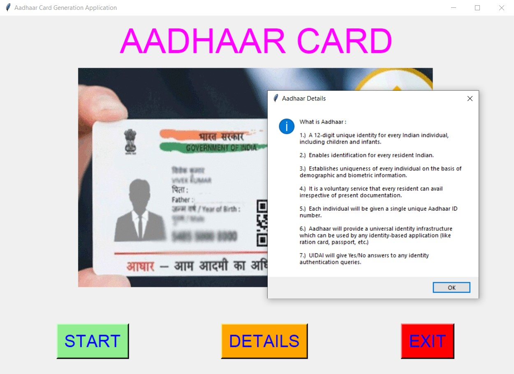
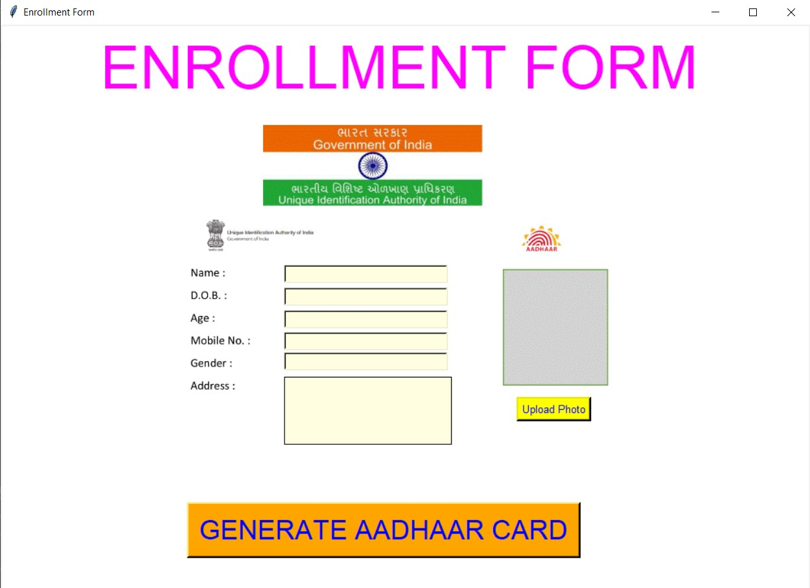
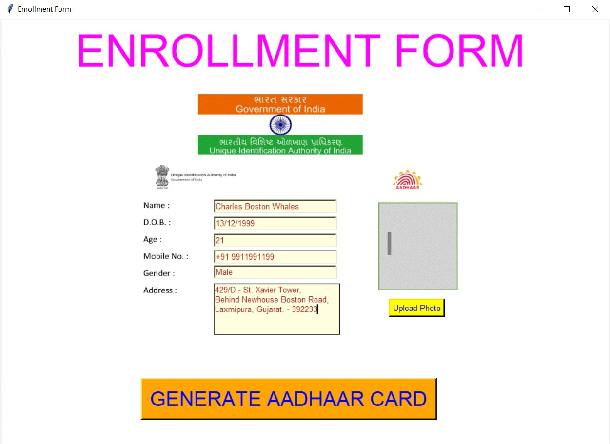
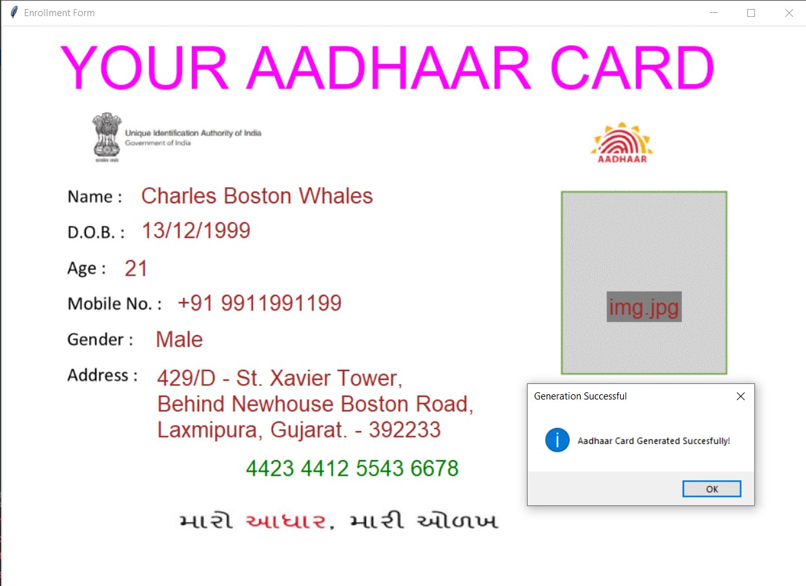

# ✔ AADHAAR CARD GENERATION APPLICATION
- #### A "Aadhaar Card Generation Application" is an application created in python with tkinter gui.
- #### In this application, user generate a simple aadhaar card by filling the enrollment form.
- #### Here user will be asked the details about Name, Age, D.O.B., gender, Mobile No., Address and also ask to upload the profile picture.
- #### And after entering this details, user will be able to generate his/her aadhaar card, along with random aadhaar card number.
- #### User will also be able to see what is aadhaar and why it is required.

****

# REQUIREMENTS :
- #### python 3
- #### tkinter module
- #### from tkinter messagebox module
- #### from PIL import Image,ImageTk
- #### from tkinter import filedialog
- #### os

****

# How this Script works :
- #### User just need to download the file and run the aadhaar_card_generation_application.py on their local system.
- #### Now on the main window of the application the user will be able to buttons like START and DETAILS.
- #### On clicking on the DETAILS button, User will be able to see what is aadhaar and why it is required.
- #### And on clicking on the START button user will be asked to fill the enrollment form.
- #### In the enrollment form user will be asked the basic details like, Name, Age, D.O.B., gender, Mobile No., Address and also ask to upload the profile picture.
- #### After entering these details in the enrollment form, when user clicks on the GENERATE AADHAAR CARD button, user will be able to see the aadhaar card with all the entered details and also with random aadhaar card number.
- #### Also there is an exit button, clicking on which exit dialog box appears asking for the permission of the user for closing the window.

# Purpose :
- #### This scripts helps us to easily get the importance of generating AADHAAR card and gets little hands on experience of how AADHAAR card is generated.

# Compilation Steps :
- #### Install tkinter, PIL, os
- #### After that download the code file, and run aadhaar_card_generation_application.py on local system.
- #### Then the script will start running and user can explore it by filling the enrollment form and generating his/her aadhaar card. 

****

# SCREENSHOTS :

****

   
   
   
   
   
   
   

****

# Author :
- ### Akash Ramanand Rajak
