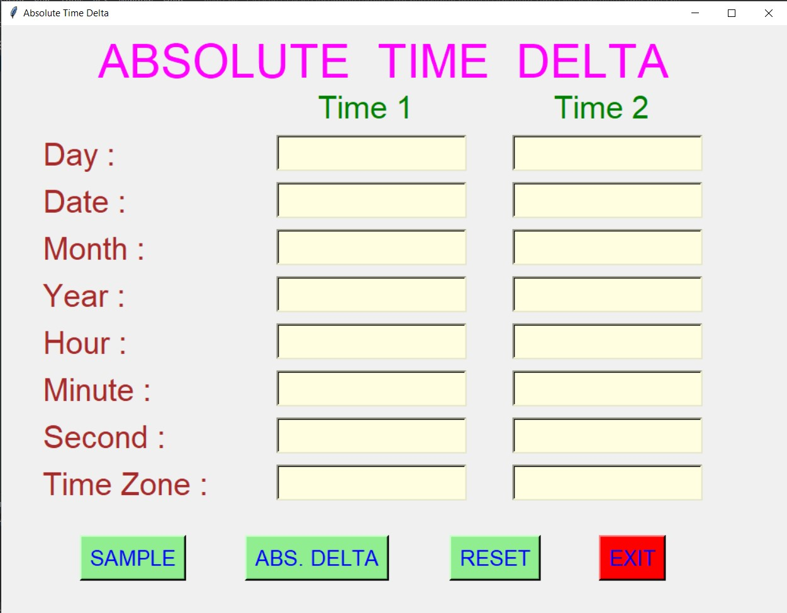
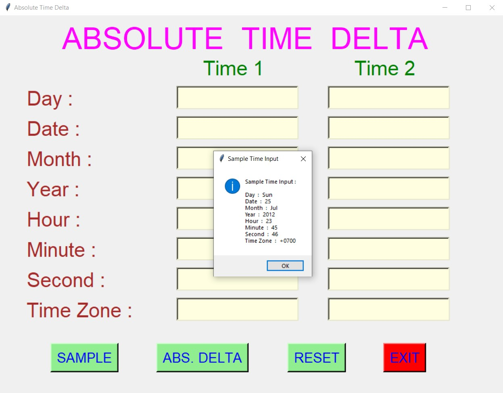
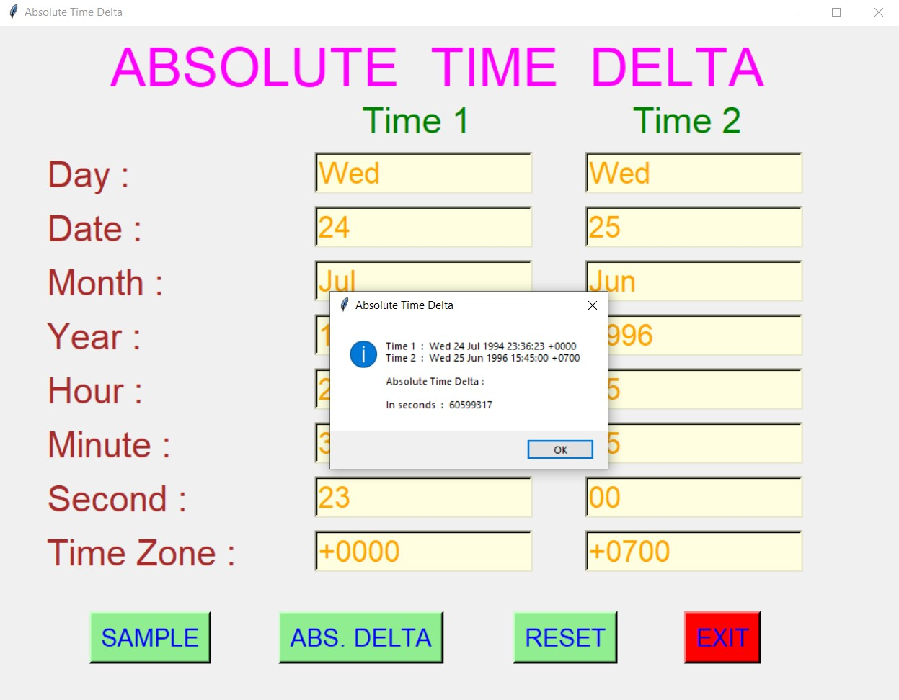
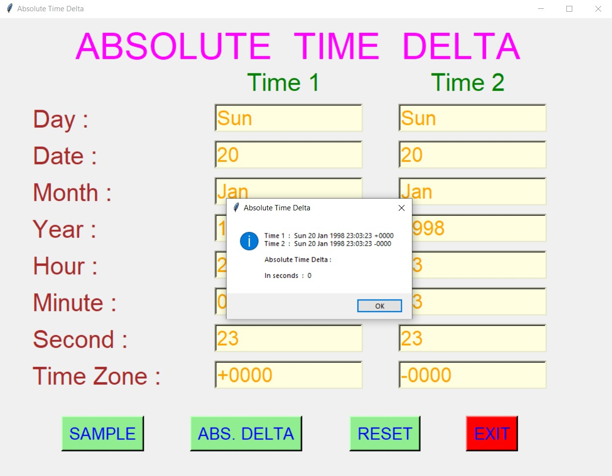
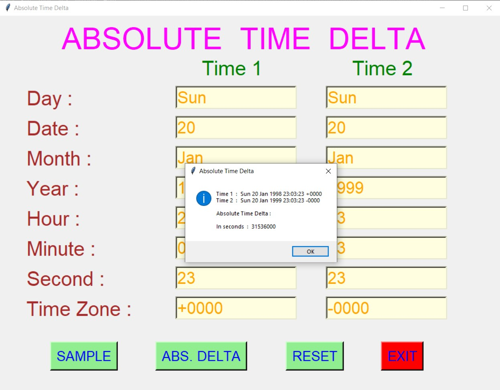
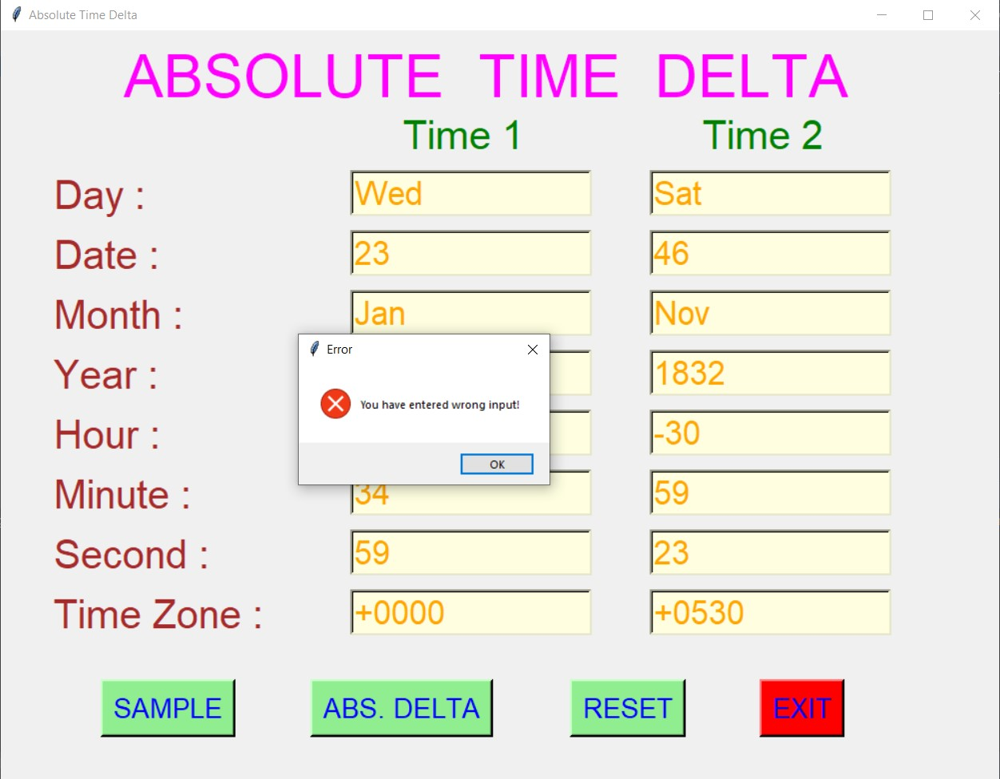
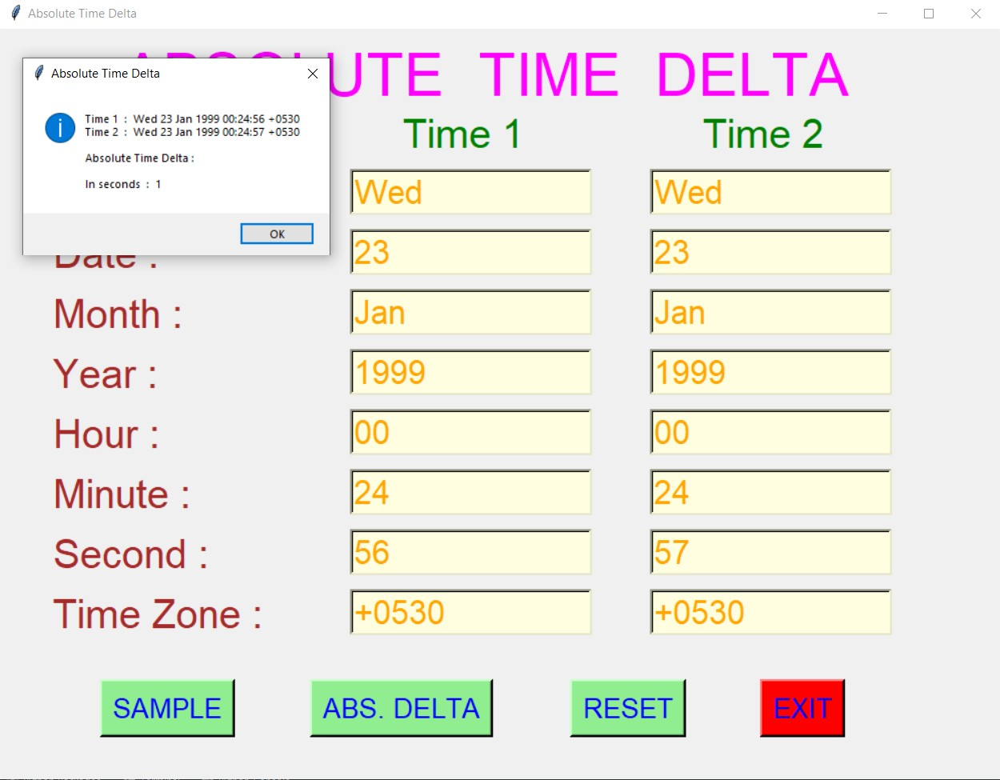
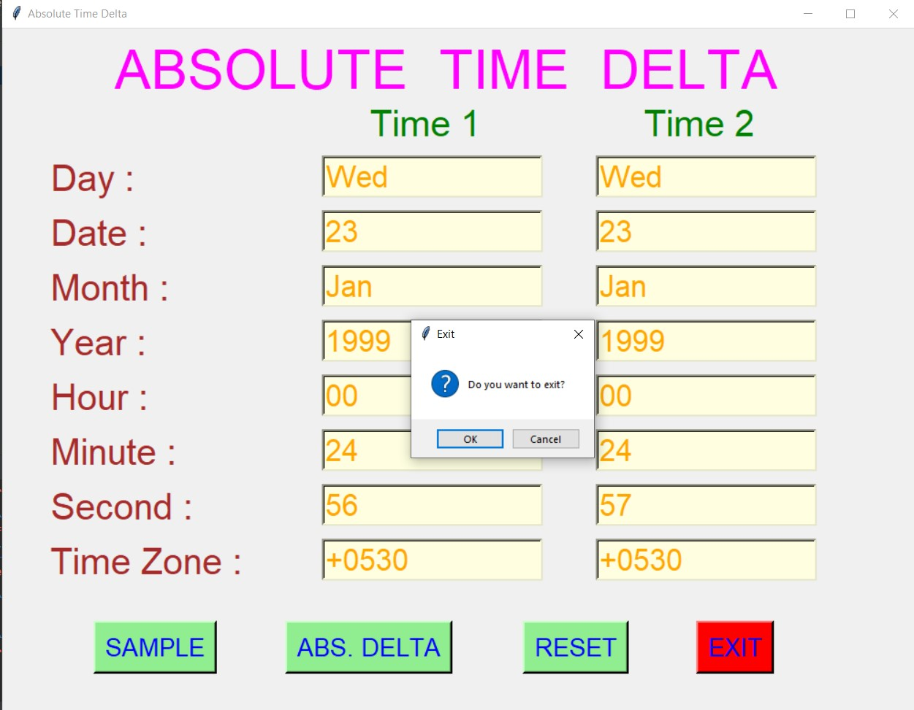

# ✔ ABSOLUTE TIME DELTA
- #### A "Absolute Time Delta" is an application created in python with tkinter gui.
- #### In this application, user will be able to find the absolute time delta between two inputed time in a very precise way.
- #### User can enter two times in terms of Day, Date, Month, Year, Hour, Minute, Second and Time Zone, and can get the absolute time difference between both this time in seconds.
- #### Also when user has entered any thing wrong in the entry, then it will show error for the same.

****

# REQUIREMENTS :
- #### python 3
- #### tkinter module
- #### from tkinter messagebox module
- #### from datetime import datetime

****

# How this Script works :
- #### User just need to download the file and run the absolute_time_delta.py on their local system.
- #### Now on the main window of the application the user needs to enter the valid two times.
- #### Also there is a sample button, clicking on which user will be able to see the sample input.
- #### After entering both times, when user click son the ABS. DELTA button, he/she will be able to see the absolute difference in second of both the times.
- #### And if there is error in entering times, then it will show error message like "You have entered wrong input."
- #### Also there is a reset button, clicking on which reset all the entry box to empty.
- #### Also there is an exit button, clicking on which exit dialog box appears asking for the permission of the user for closing the window.

# Purpose :
- #### This scripts helps us to easily get the absolute difference between any two times very precisely.

# Compilation Steps :
- #### Install tkinter, datetime
- #### After that download the code file, and run absolute_time_delta.py on local system.
- #### Then the script will start running and user can explore it by entering valid times and finding absolute delta for same.

****

# SCREENSHOTS :

****

   
   
   
   
   
   
   
   

****

# Name :
- ### Akash Ramanand Rajak

