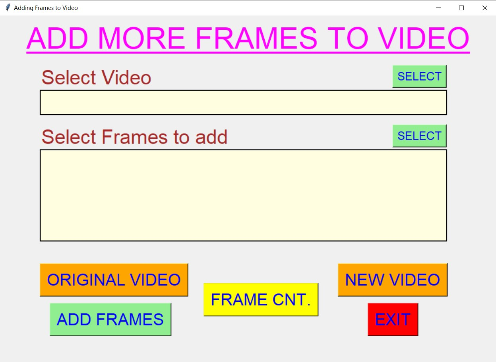
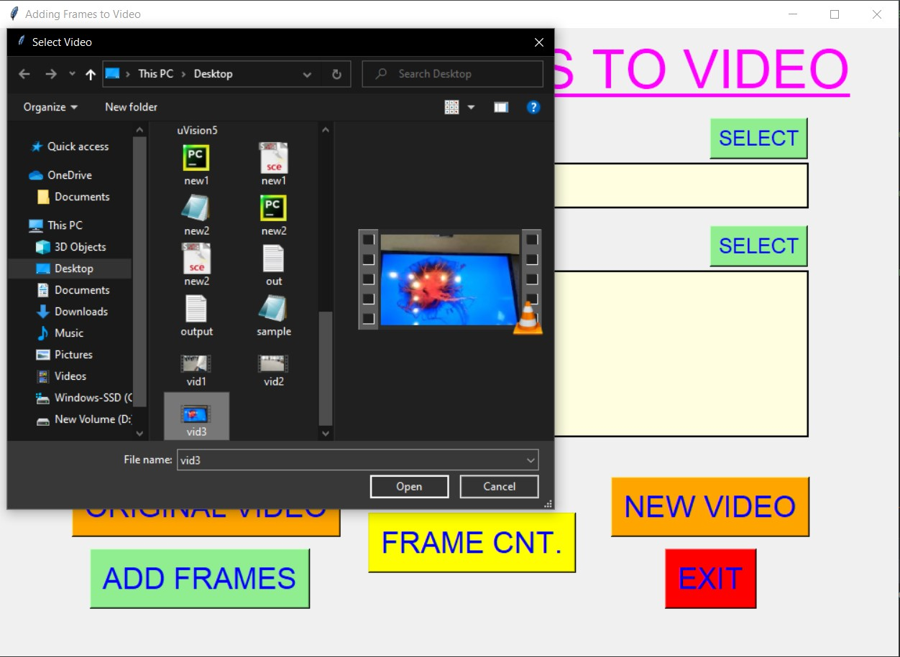
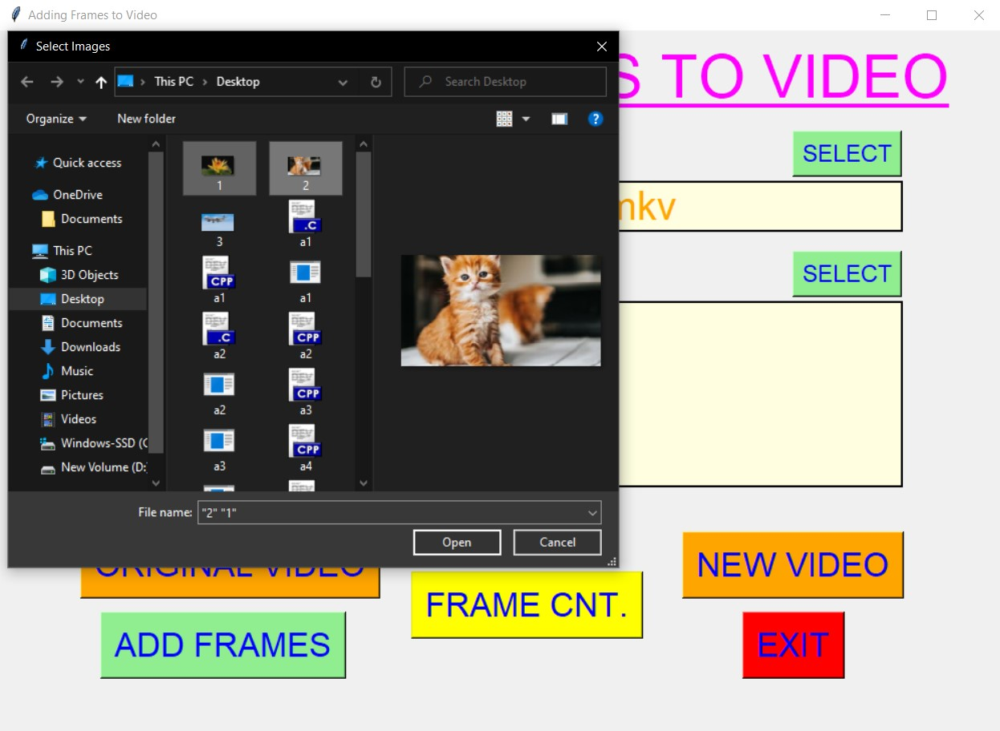
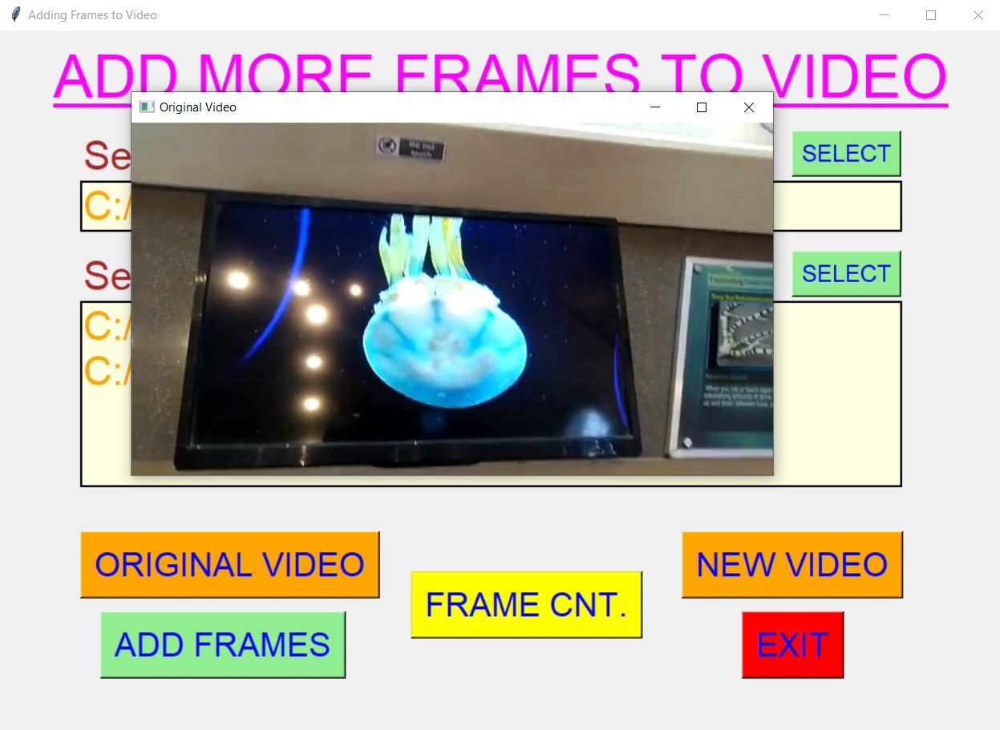
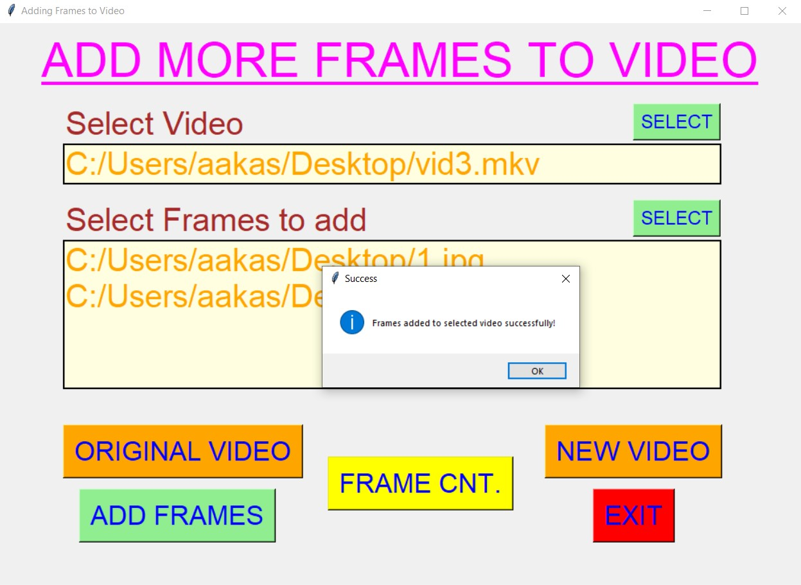
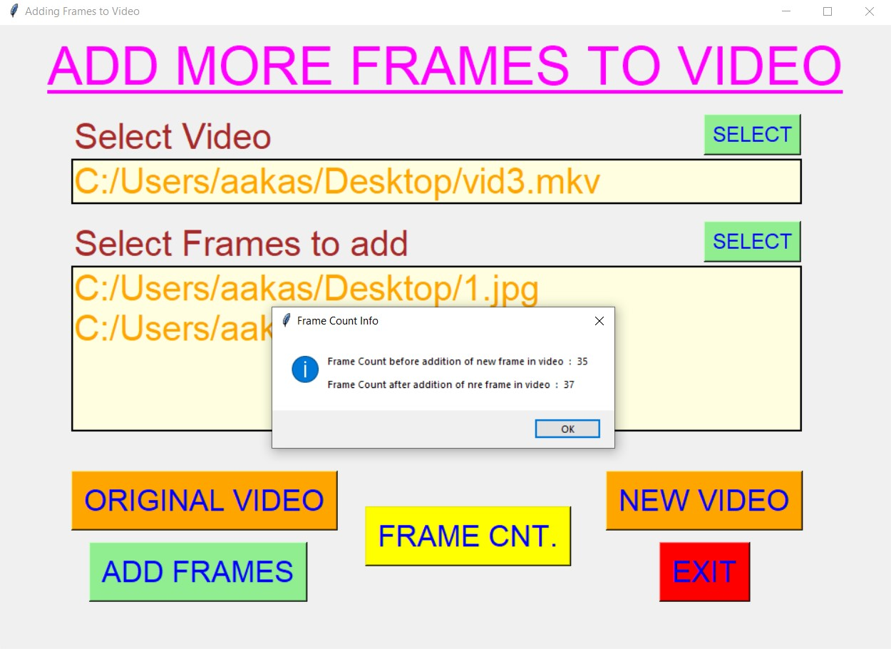
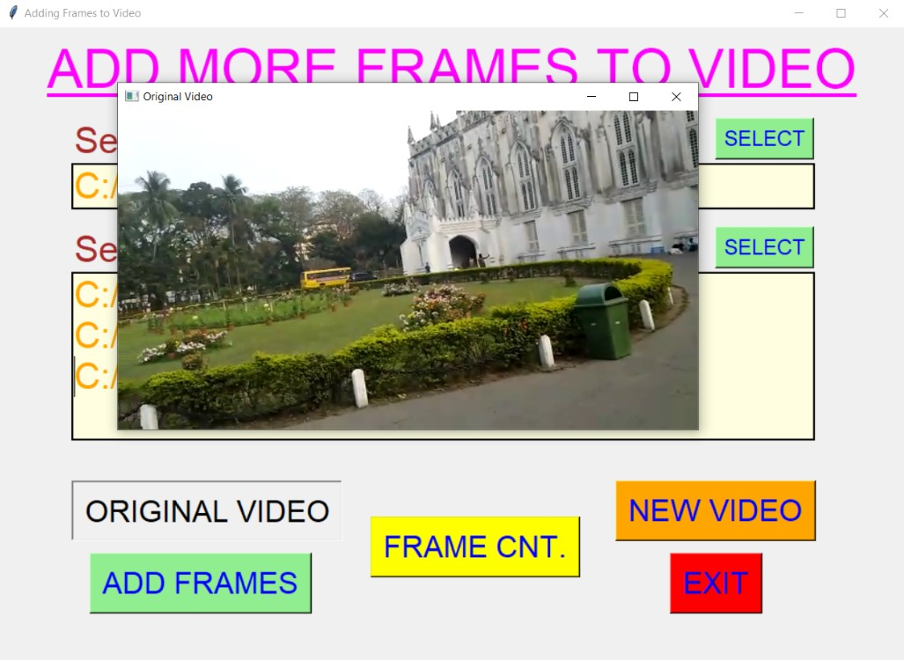
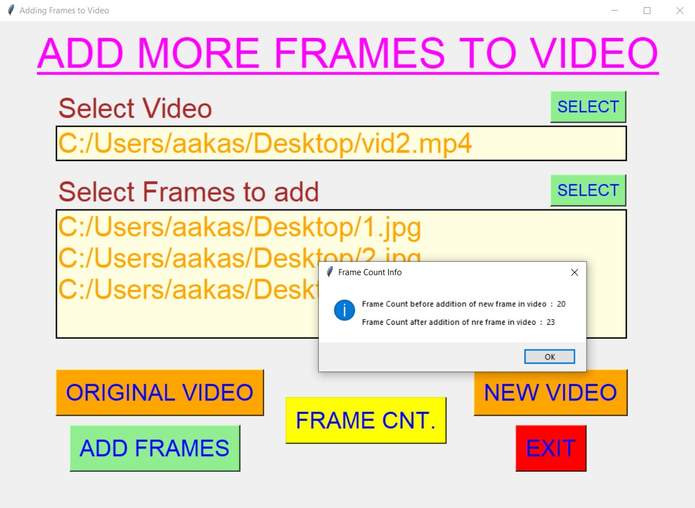
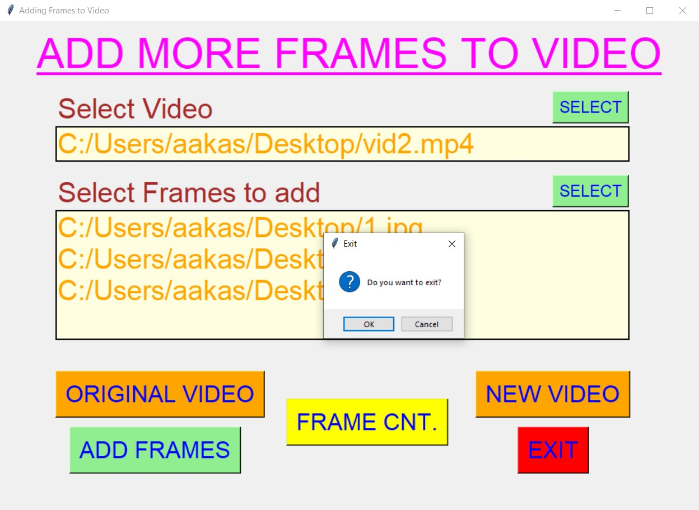

# ✔ ADDING FRAMES TO VIDEO
- ### An "Adding Frames to Video" is an application created in python with tkinter gui and OpenCv library.
- ### In this application user can select any video (either mpy, mkv, avi, or any other extension of video) and any no. of frames user want to add to the video, and will be able to add that frame to the selected video.
- ### Also user will be able to see the preview of original video(without additional frames) and new video(with additional video).
- ### Along with this user can also see the frame count before and after adding frames.

****

# REQUIREMENTS :
- ### python 3
- ### tkinter module
- ### filedialog from tkinter
- ### messagebox
- ### from PIL import Image, ImageTk
- ### cv2
- ### moviepy

****

# HOW TO Use it :
- ### User just need to download the file, and run the adding_frames_to_video.py, on local system.
- ### After running a GUI window appears, where user can start the video main application by clicking on the START button.
- ### After that a new GUI window will open, in which user will have option to select video, select frames to be added, ADD FRAMES button and many more.
- ### User can select any video file (either mpy, mkv, avi, or any other extension of video) from the local system, and any no. of frames user want to add to the video, using SELECT button.
- ### After user has selected video, user will be able to see the path of the video selected and the images selected in the text area.
- ### After this, when user clicks on the ADD FRAMES button, the frame addition process will start and after completion user will get a success message.
- ### After that user can see the preview of original video and the new video using the respective button.
- ### Also there is a FRAME CNT button, clicking on which user can see the count of frame in video before and after adding selected frames.
- ### Also there is an EXIT button clicking opn which user can exit from the application.

# Purpose :
- ### This scripts helps user to easily add more frames to video, by selecting any video and necessary frames from local system.

# Compilation Steps :
- ### Install tkinter, PIL, cv2, moviepy
- ### After that download the code file, and run adding_frames_to_video.py on local system.
- ### Then the script will start running and user can explore it by selecting any video and no. of frames, and adding it to the video.

****

# SCREENSHOTS :
****

   
   
   
   
   
   
   
   
   
   
   
   

****

# Name : 
- ### Akash Ramanand Rajak
