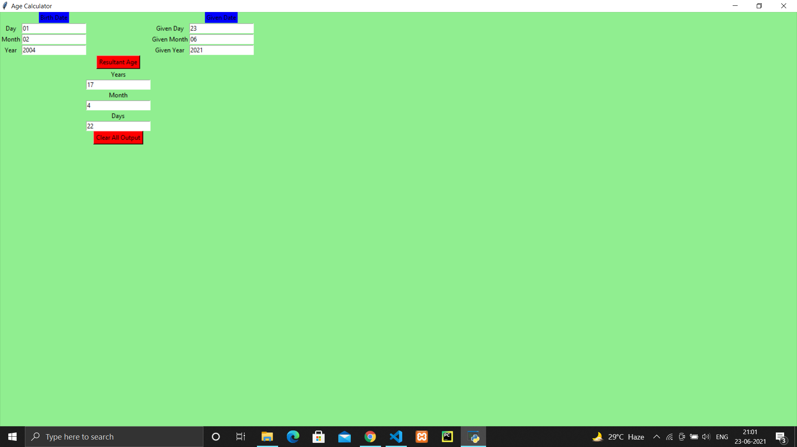

# Age Calculator GUI

## Aim
To implement age calculator application using python

## Purpose
To calculate age by taking birth date and current date as input and giving age as output

## Short description:
This application can be used anywhere for example (in forms) by taking birth date and current date as input it will give the current age of person as output.
I have implemented this application using various python modules with GUI python tkinter .

List out the libraries imported: tkinter, datetime

## Workflow
Python offers a very good GUI library i.e. tkinter which is very easy to learn and use.
Here, I have implemented a GUI application to calculate age using a button.
In application, user is asked to enter date of birth and current date.
Then using that information from the entry widgets and it calculates the user’s age.
At last, it shows the user’s age.

## Compilation steps

* install python in your system
* import tkinter module
* run command - python age_calculator.py in your terminal

## Output

## Author
Alisha Anand

