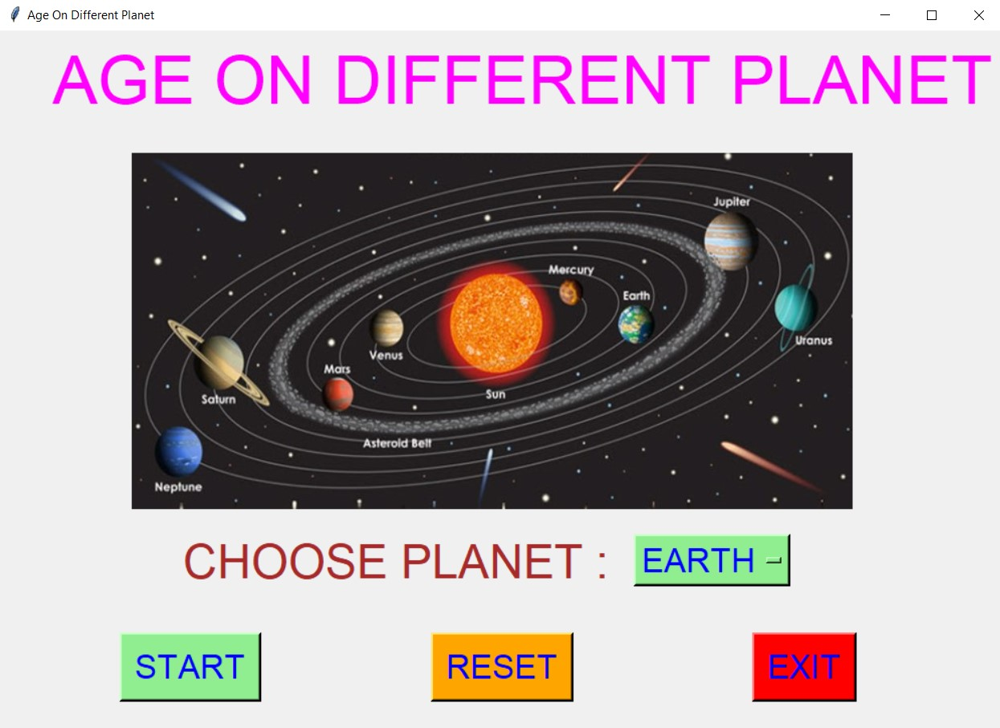
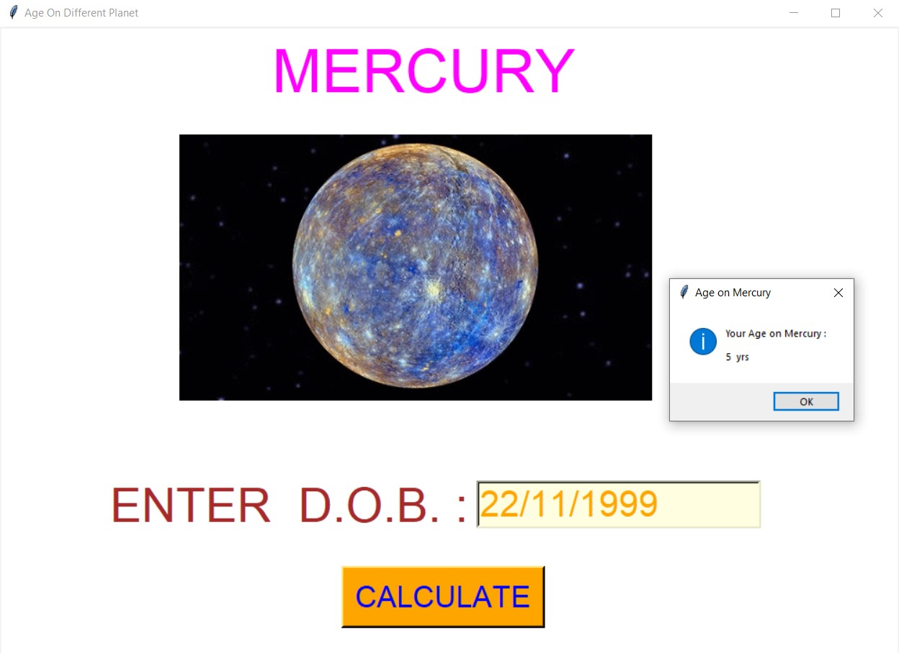
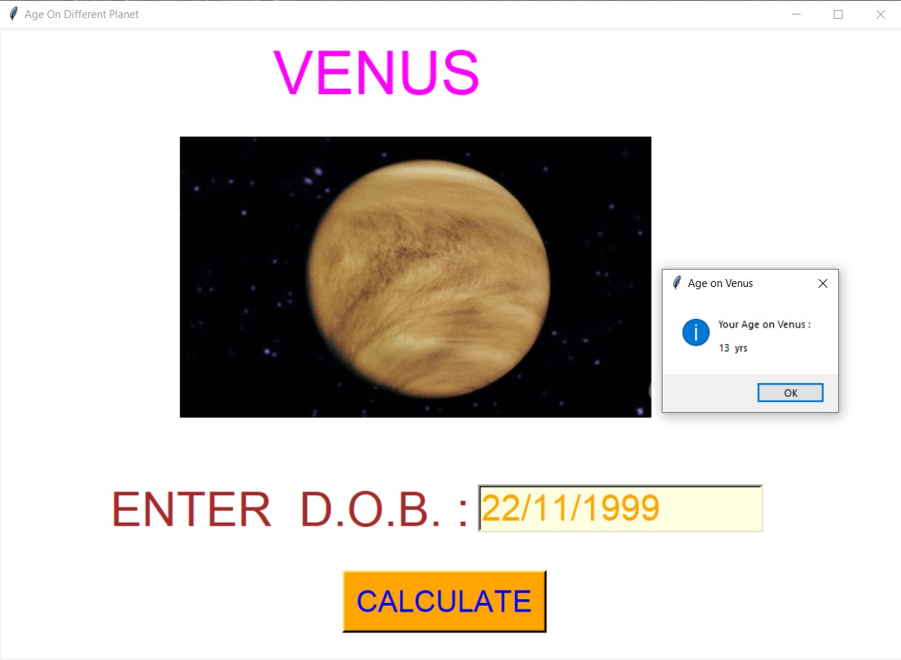
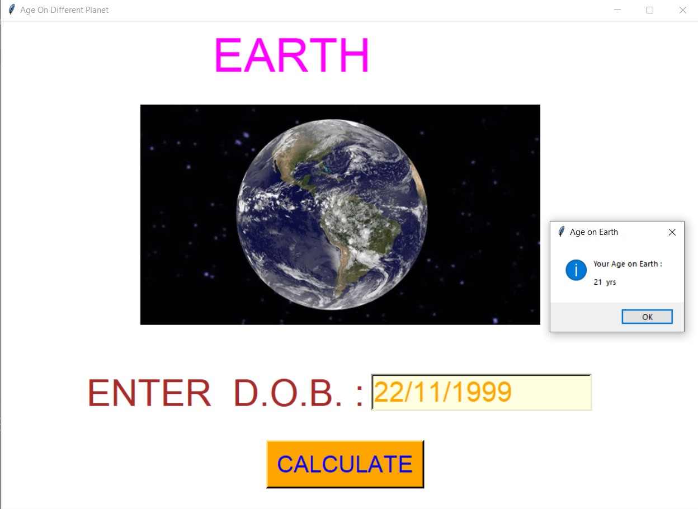
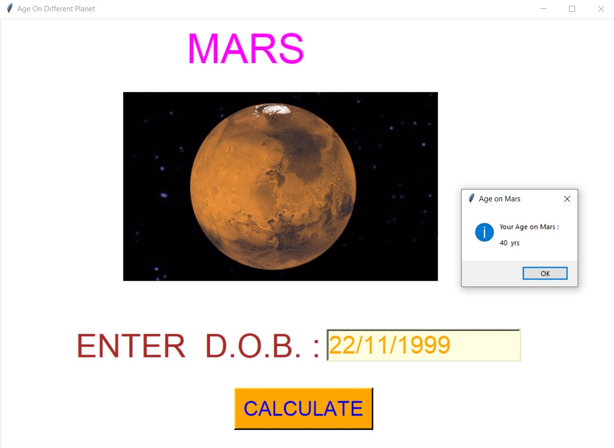
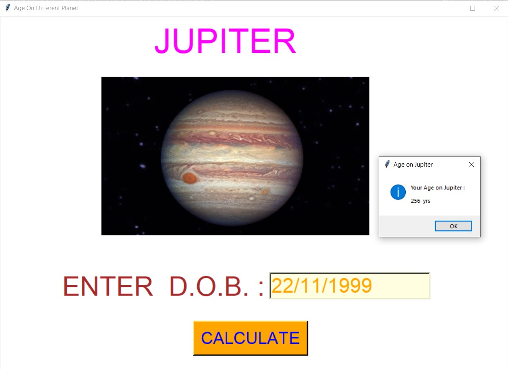
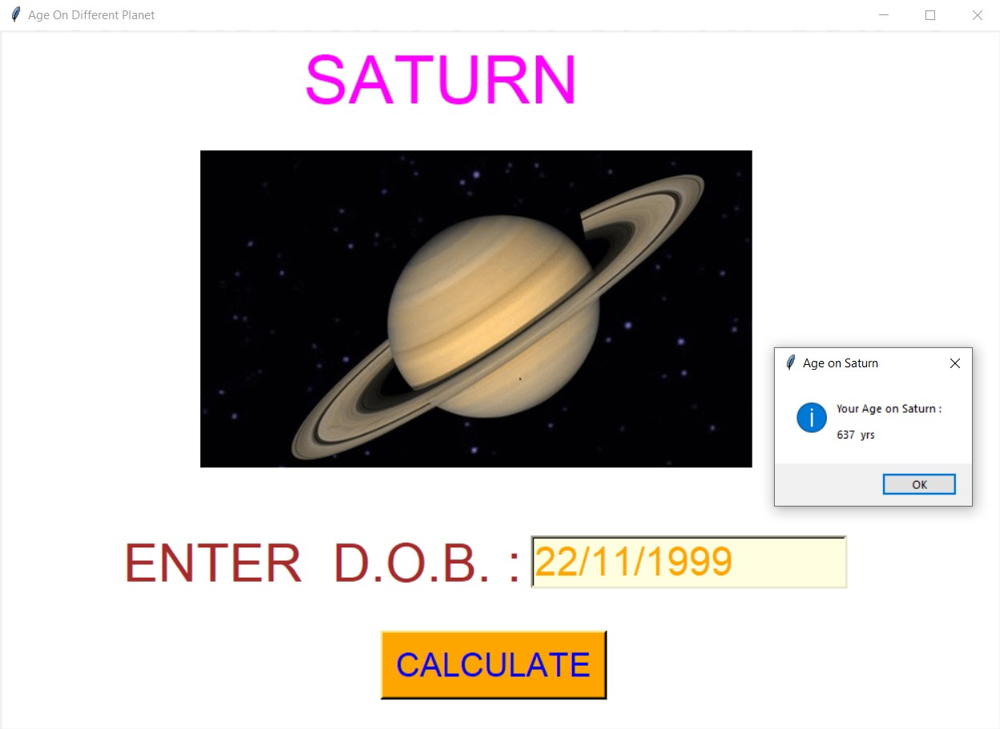
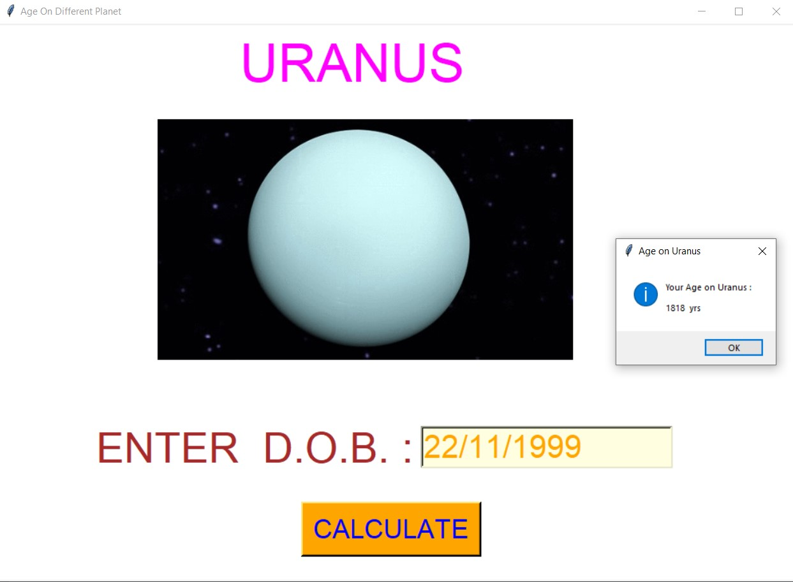
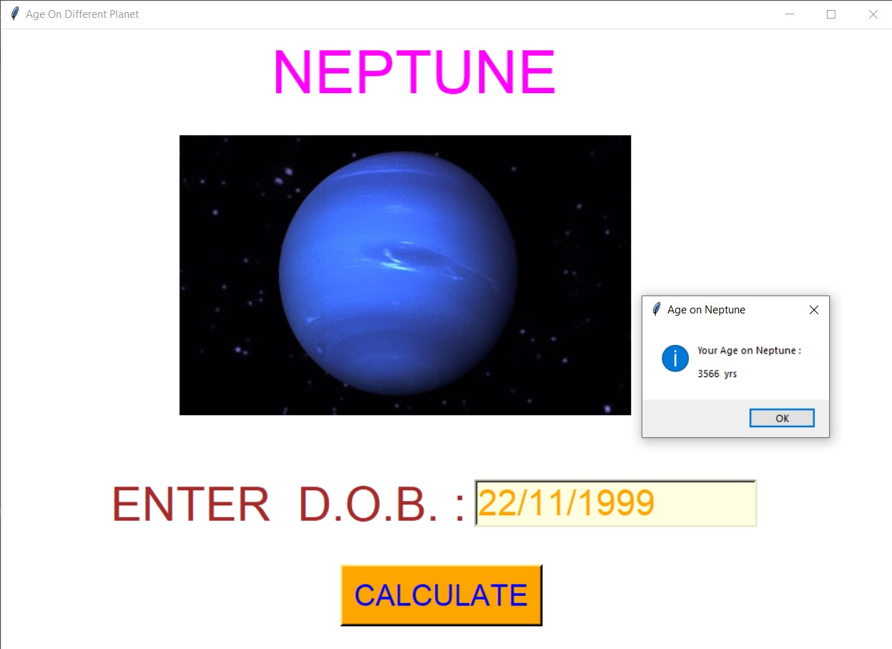
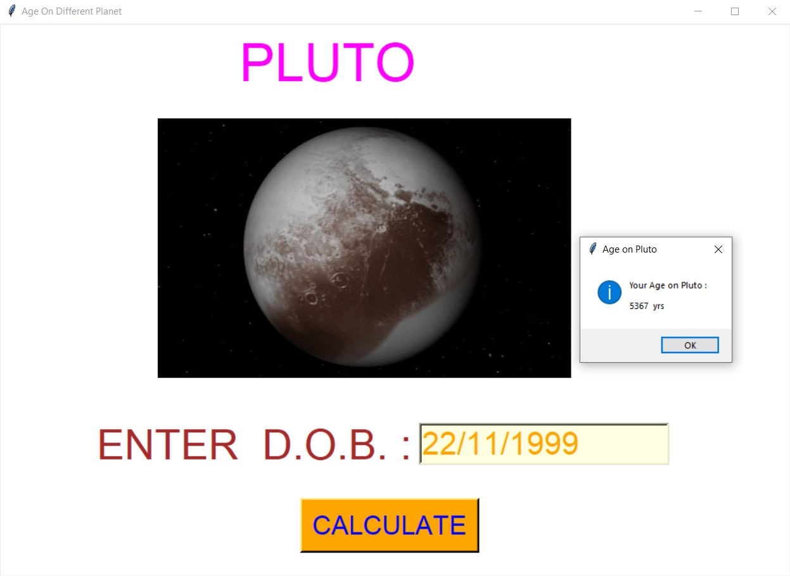

# ✔ AGE ON DIFFERENT PLANET
- #### A "Age On Different Planet" created in python with tkinter gui.
- #### In this script, the user will be able to calculate his/her age on any planet by selecting that planet and entering the date of birth.
- #### The age on different planet will be shown in years.

****

# REQUIREMENTS :
- #### python 3
- #### tkinter module
- #### from tkinter messagebox module
- #### from PIL import Image, ImageTk
- #### datetime

****

# How this Script works :
- #### User just need to download the file and run the age_on_different_planet.py on their local system.
- #### Now on the main window of the script the user is asked to select the planet on which user wants to calculate his/her age.
- #### After choosing the planet, when player click on the Start button, he will be redirected to new frame where user will be asked to enter his/her D.O.B. and click on Calculate.
- #### After clicking the user age on that selected planet will be shown in the message box.
- #### Also there is a reset button, clicking on which user can reset the planet he/she has selected.
- #### Also there is an exit button, clicking on which exit dialog box appears asking for the permission of the user for closing the window.
- #### This way user can get to know about his/her age on any of the 9 planets.

# Purpose :
- #### This scripts helps us to easily calculate his/her age on any planet.

# Compilation Steps :
- #### Install tkinter, PIL, datetime
- #### After that download the code file, and run age_on_different_planet.py on local system.
- #### Then the script will start running and user can explore it by calculating his/her age on any planet.

****

# SCREENSHOTS :

****

   
   
   
   
   
   
   
   
   
   

****

# Name :
- ### Akash Ramanand Rajak
