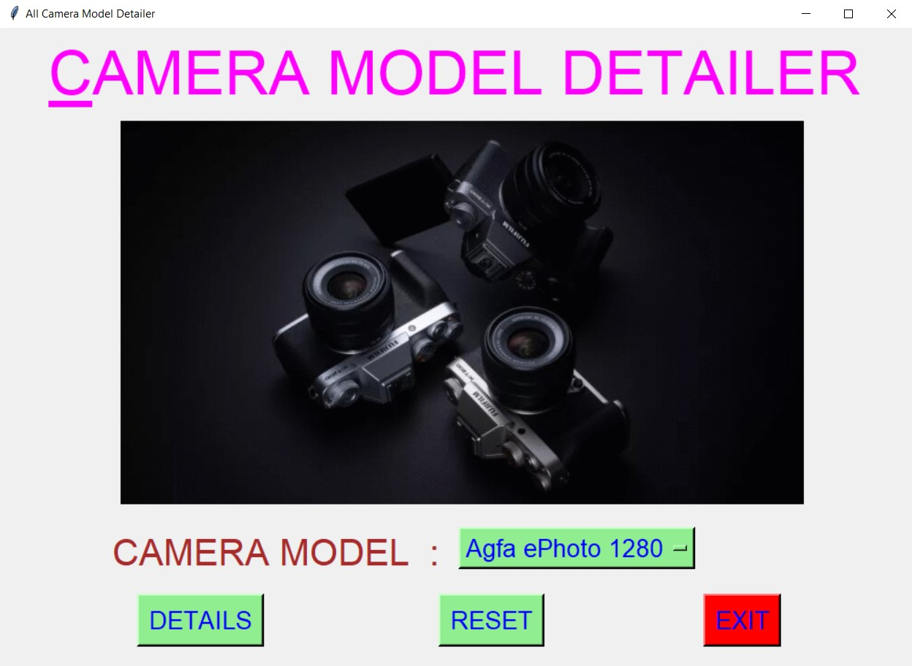
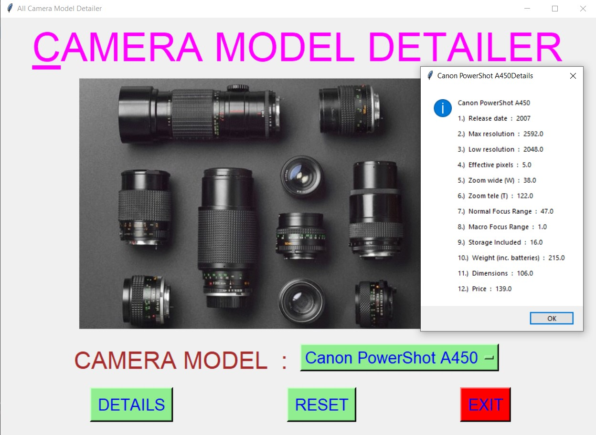
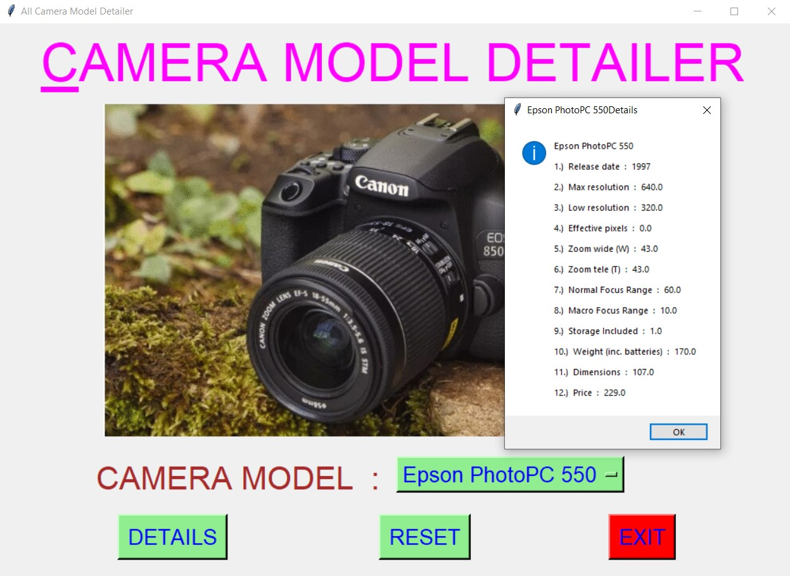
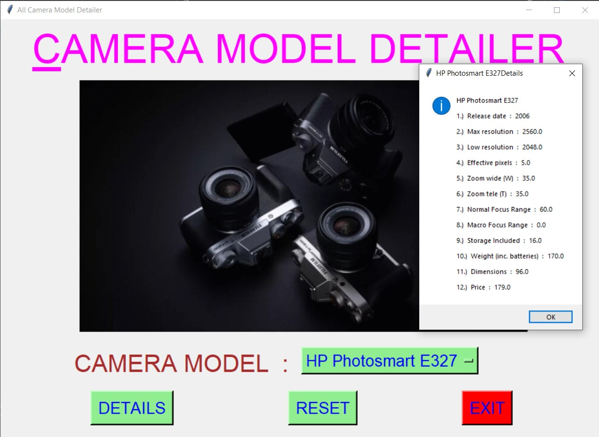
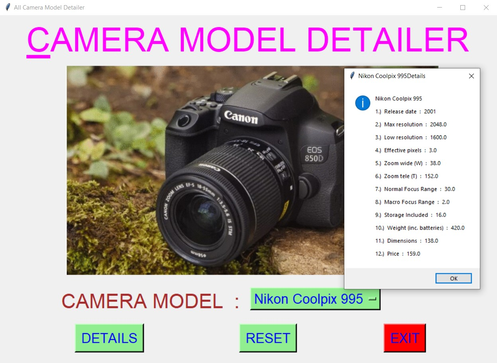
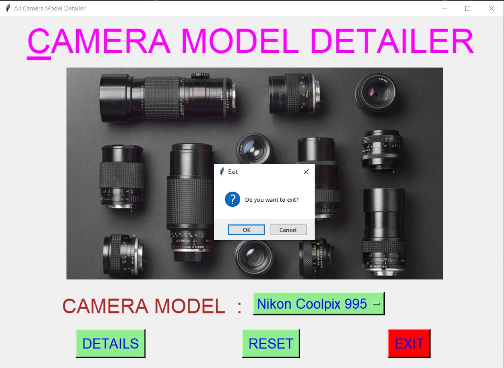

# ✔ ALL CAMERA MODEL DETAILER
- ### A "All Camera Model Detailer" is an application created in python with tkinter gui.
- ### In this application, user can find details of about 1000's of different camera model till now.
- ### The details will be in terms of Release date, Max resolution, Low resolution, Effective pixels, Zoom wide (W), Zoom tele (T), Normal focus range, Macro focus range, Storage included, Weight (inc. batteries), Dimensions, and Price.
- ### for the data, used the camera_dataset.csv data, and read using pandas library.

****

# REQUIREMENTS :
- ### python 3
- ### tkinter module
- ### from tkinter messagebox module
- ### pandas

****

# How this Script works :
- ### User just need to download the file and run the all_camera_model_detailer.py on their local system.
- ### Now on the main window of the application the user needs to select the Camera Model from the drop down list Option Menu.
- ### After user has chosen the Camera Model name, when user clicks on the DETAILS button, he/she will be able to see the details of that selected camera model in terms of Release date, Max resolution, Low resolution, Effective pixels, Zoom wide (W), Zoom tele (T), Normal focus range, Macro focus range, Storage included, Weight (inc. batteries), Dimensions, and Price.
- ### Also there is a reset button, clicking on which user can resets both the Option Menu to default Camera Model Name i.e. "Agfa ePhoto 1280".
- ### Also there is an exit button, clicking on which exit dialog box appears asking for the permission of the user for closing the window.

# Purpose :
- ### This scripts helps us to easily get the details about more than 1000's of Camera Model(especially for Camera Lover).

# Compilation Steps :
- ### Install tkinter, pandas
- ### After that download the code file, and run all_camera_model_detailer.py on local system.
- ### Then the script will start running and user can explore more and more about any Camera Model, by just selecting the camera Model Name.

****

# SCREENSHOTS :

****

   
   
   
   
   
   
   

****

# Name :
- ### Akash Ramanand Rajak