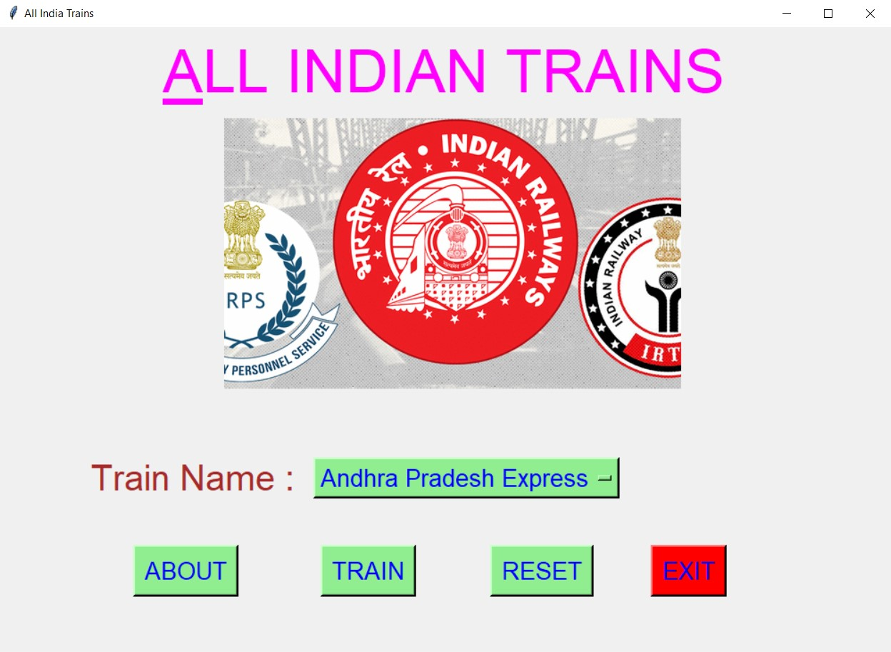
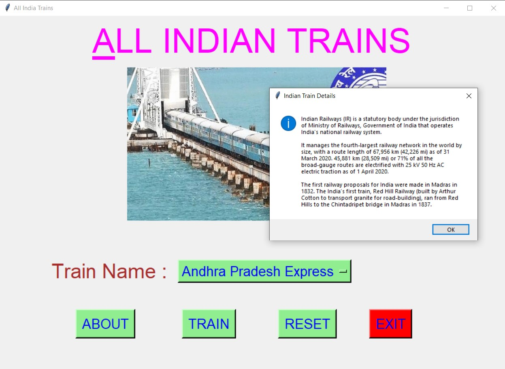
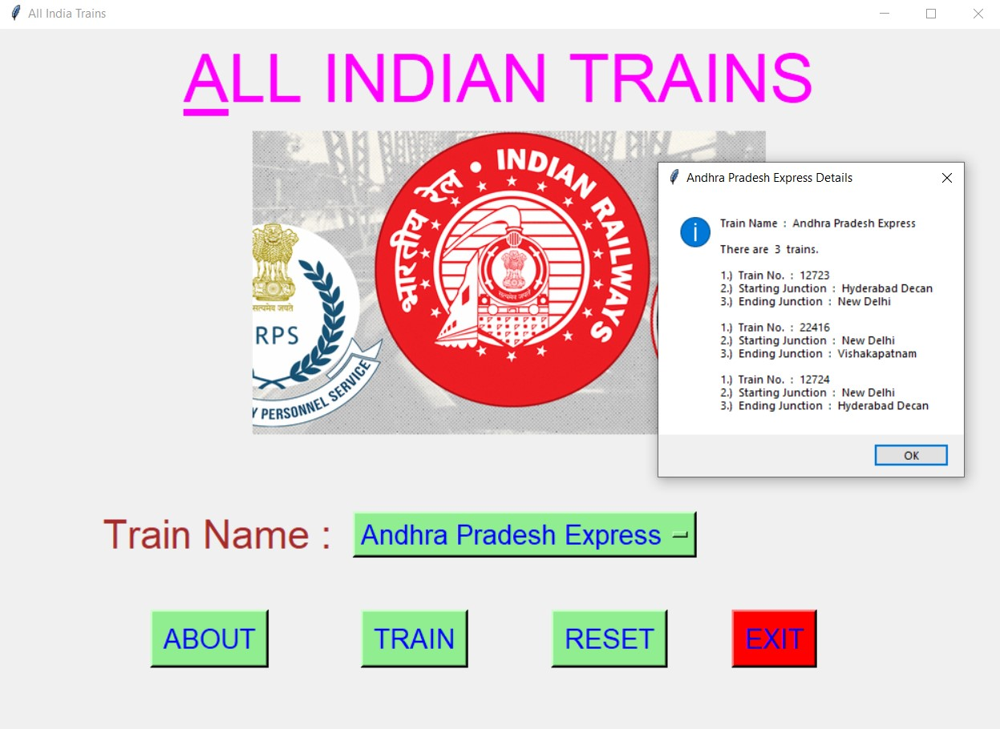
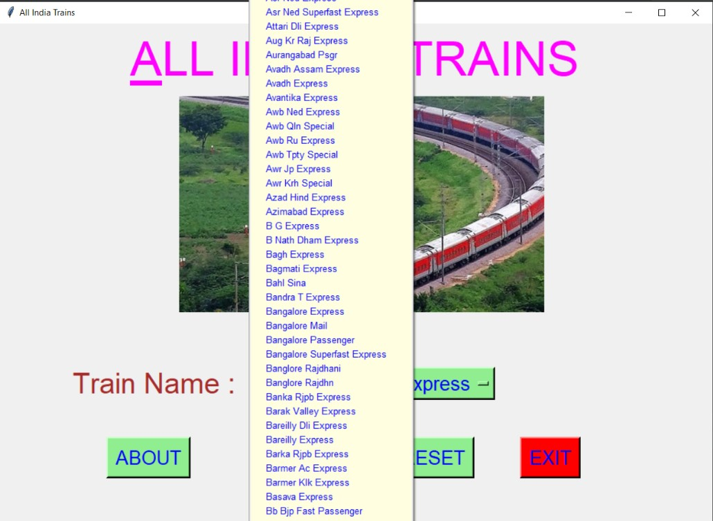
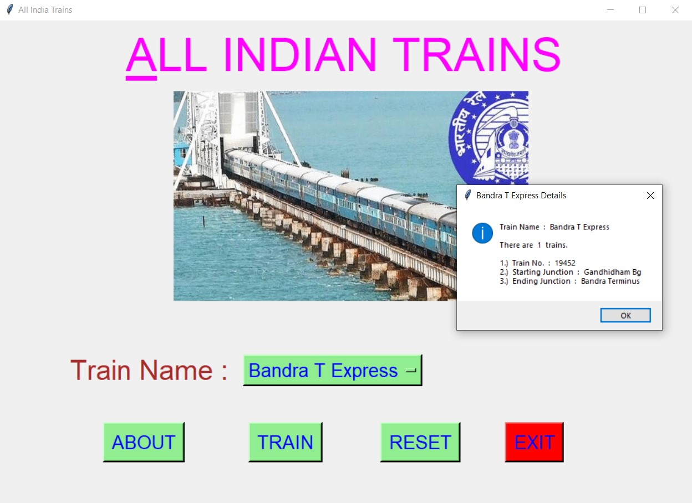
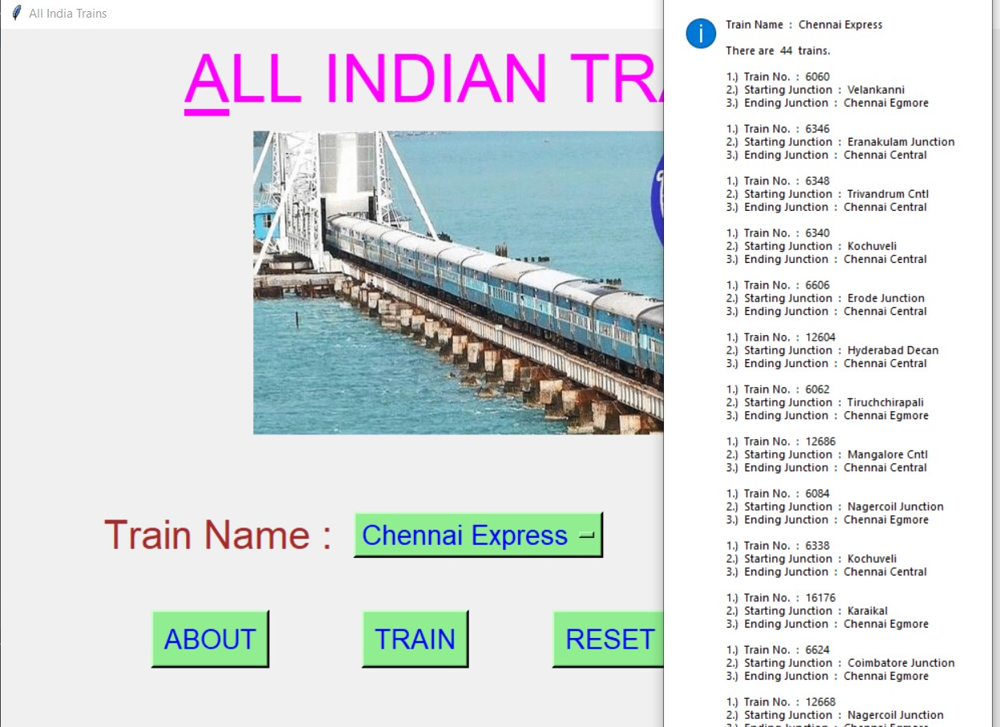
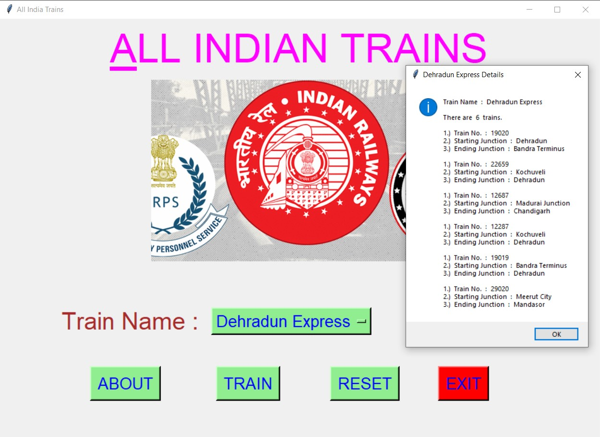
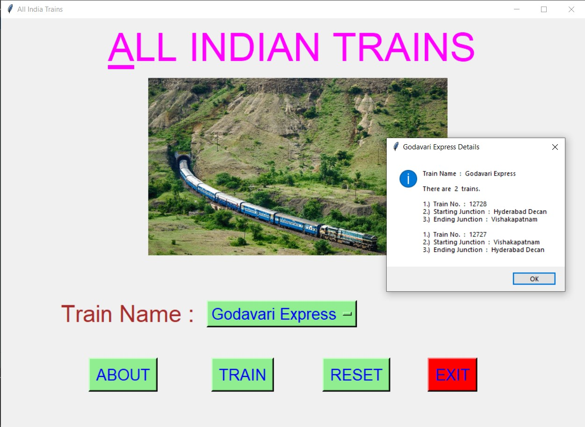
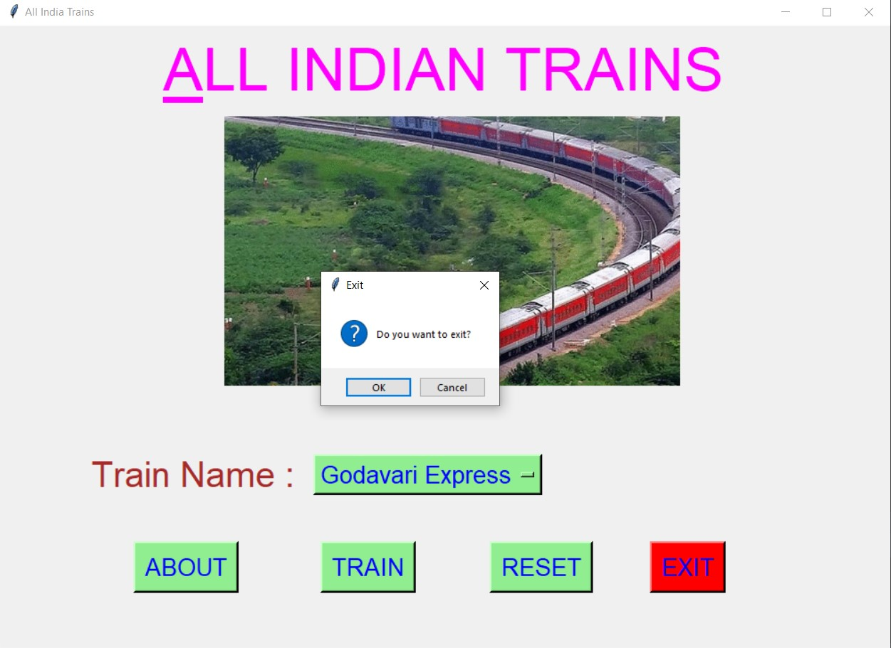

# ✔ ALL INDIAN TRAINS
- ### A "All Indian Trains" is an application created in python with tkinter gui.
- ### In this application, user can get the information about how many trains are there in India with given Train Name.
- ### Along with that, this scripts also gives us details about Train No., Starting Junction and Ending Junction of each train with same Train Name.
- ### for the data, used the All_Indian_Trains.csv data, and read using pandas library.

****

# REQUIREMENTS :
- ### python 3
- ### tkinter module
- ### from tkinter messagebox module
- ### pandas

****

# How this Script works :
- ### User just need to download the file and run the all_indian_trains.py on their local system.
- ### Now on the main window of the application the user needs to select the name of Train from the drop down OptionMenu.
- ### After user has chosen the name of Train, when user clicks on the TRAIN button, he/she will be able to see the details like, how many trains are there with that name, and for each of those train, the details about Train No., Starting Junction and Ending Junction are also provided.
- ### Also there is a ABOUT button, clicking on which user can see about history of indian Railway.
- ### Also there is a RESET button, clicking on which user can resets both the Option Menu to default element name "Indian Institute of Technology Madras".
- ### Also there is an EXIT button, clicking on which exit dialog box appears asking for the permission of the user for closing the window.

# Purpose :
- ### This scripts helps us to easily get the details about Train No., Starting Junction and Ending Junction of all the train with selected Train Name.

# Compilation Steps :
- ### Install tkinter, pandas
- ### After that download the code file, and run ll_indian_trains.py on local system.
- ### Then the script will start running and user can scroll down the drop down Option Menu of Train Names and see details for any train name.

****

# SCREENSHOTS :

****

   
   
   
   
   
   
   
   
   

****

# Author :
- ### Akash Ramanand Rajak
