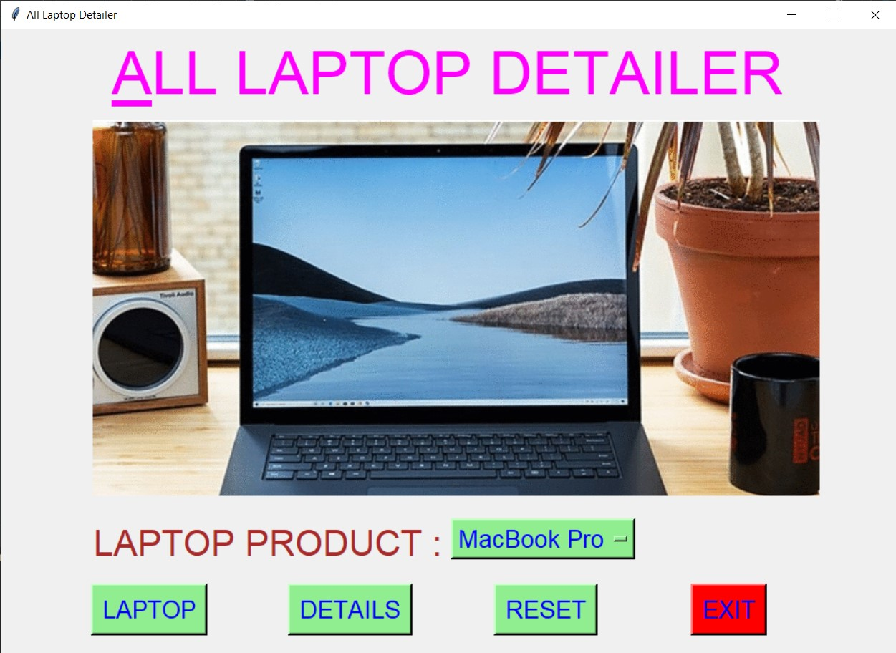
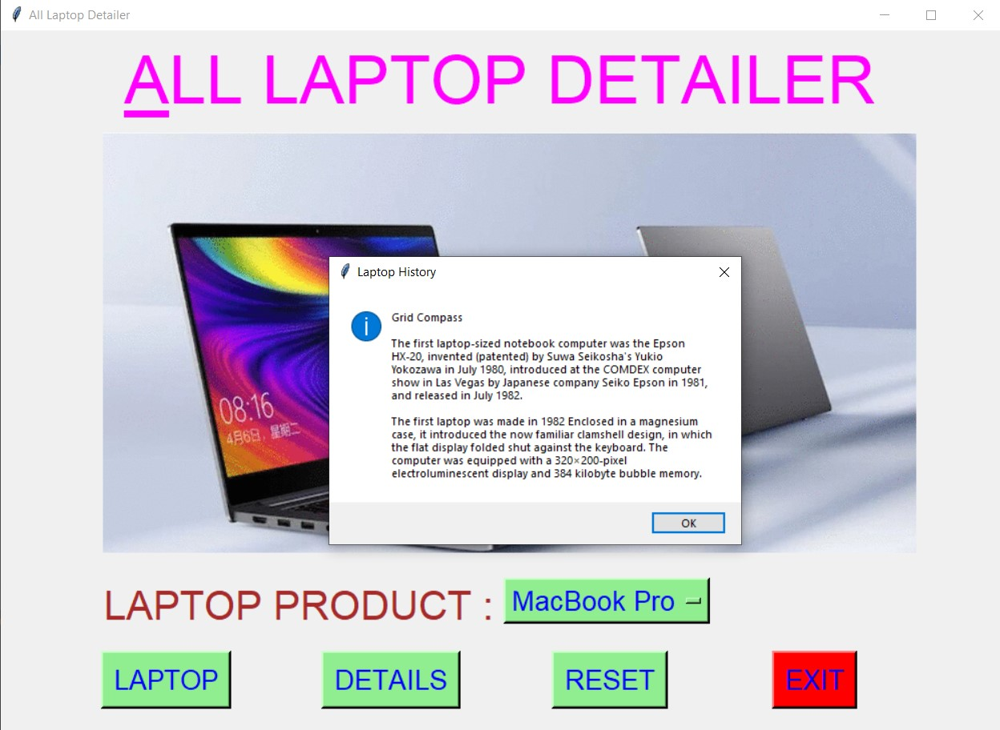
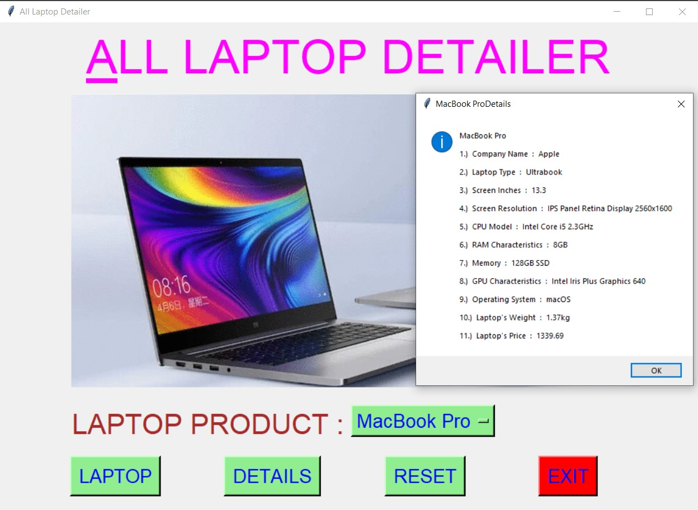
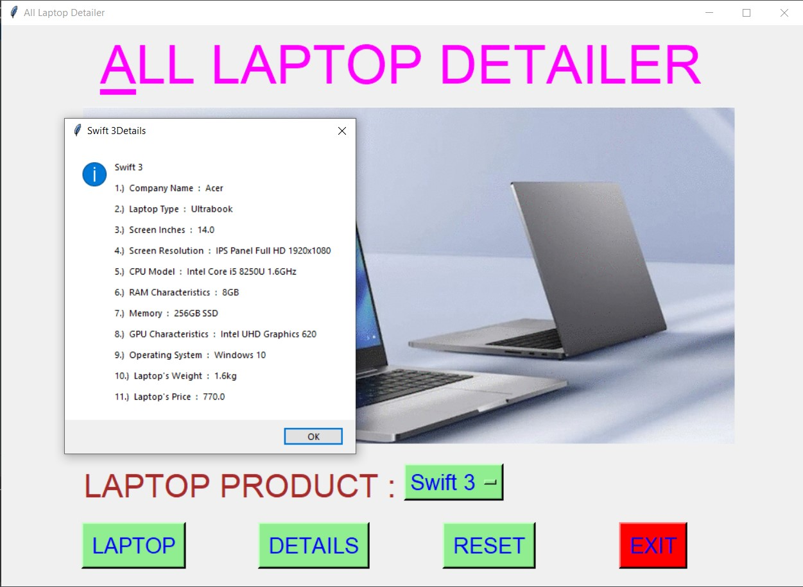
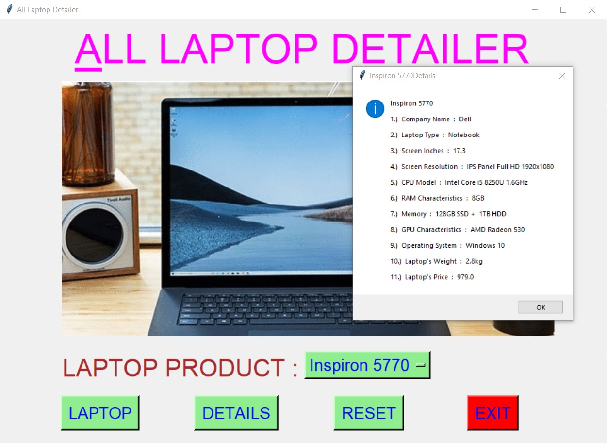
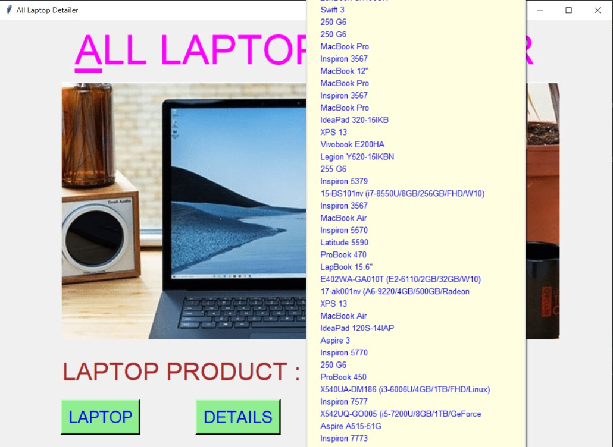
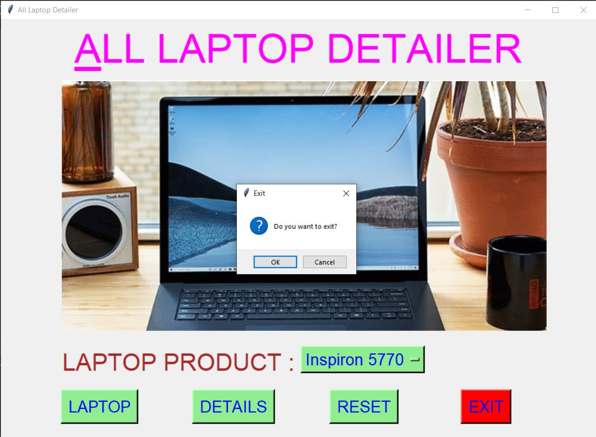

# ✔ ALL LAPTOP DETAILER
- ### A "All Laptop Detailer" is an application created in python with tkinter gui.
- ### In this application, user can find details of about more than 1300's of different laptop product till now.
- ### The details will be in terms of Company Name, Product Name, Laptop Type, Screen Inches, Screen Resolution, CPU Model, RAM Characteristics, Memory, GPU Characteristics, Operating System, Laptop's Weight, Laptop's Price.
- ### for the data, used the laptop_dataset.csv data, and read using pandas library.

****

# REQUIREMENTS :
- ### python 3
- ### tkinter module
- ### from tkinter messagebox module
- ### pandas

****

# How this Script works :
- ### User just need to download the file and run the all_laptop_detailer.py on their local system.
- ### Now on the main window of the application the user needs to select the Laptop Product from the drop down list Option Menu.
- ### After user has chosen the Laptop Product name, when user clicks on the DETAILS button, he/she will be able to see the details of that selected product in terms of Company Name, Product Name, Laptop Type, Screen Inches, Screen Resolution, CPU Model, RAM Characteristics, Memory, GPU Characteristics, Operating System, Laptop's Weight, Laptop's Price.
- ### Also there is a LAPTOP button, clicking on which user can see the history of laptop.
- ### Also there is a reset button, clicking on which user can resets both the Option Menu to default Camera Model Name i.e. "Agfa ePhoto 1280".
- ### Also there is an exit button, clicking on which exit dialog box appears asking for the permission of the user for closing the window.

# Purpose :
- ### This scripts helps us to easily get the details about more than 1300 laptop product.

# Compilation Steps :
- ### Install tkinter, pandas
- ### After that download the code file, and run all_laptop_detailer.py on local system.
- ### Then the script will start running and user can explore more and more about any laptop Product, by just selecting the product Name.

****

# SCREENSHOTS :

****

   
   
   
   
   
   
   

****

# Name :
- ### Akash Ramanand Rajak

