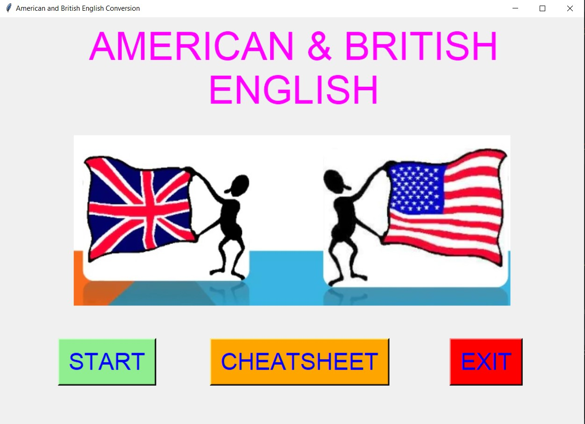
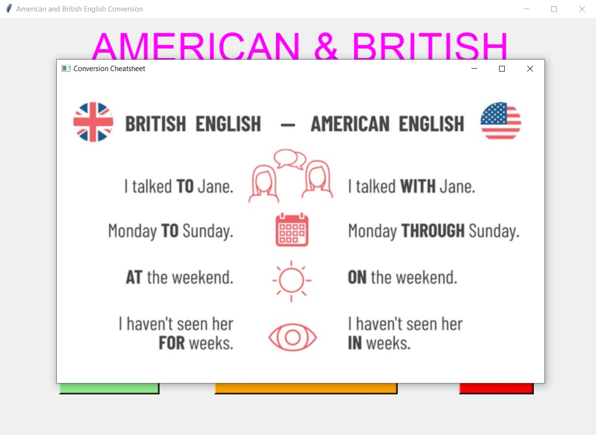
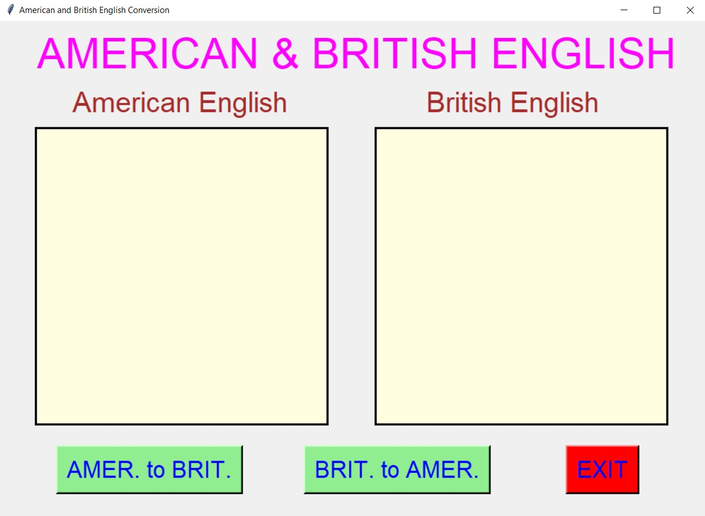
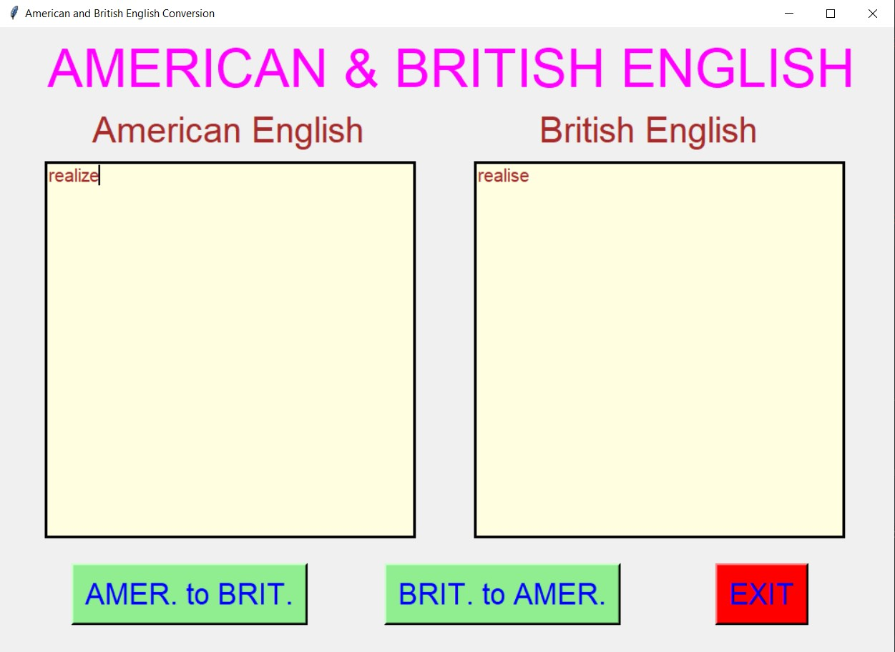
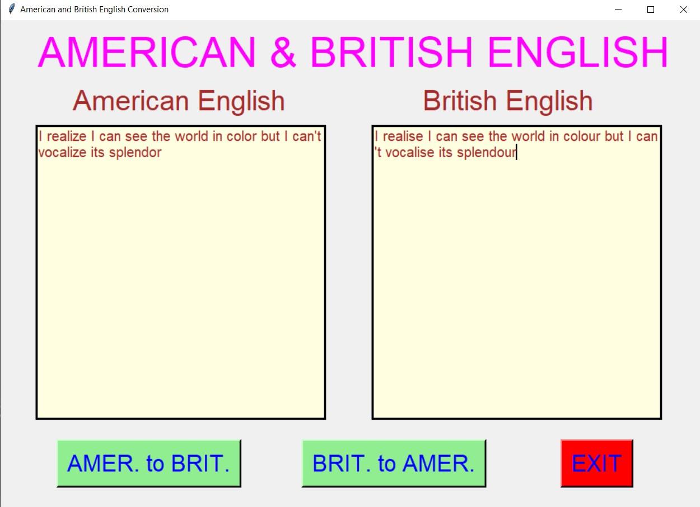
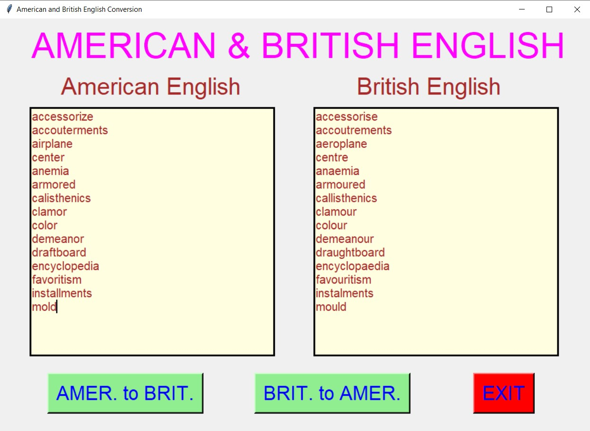
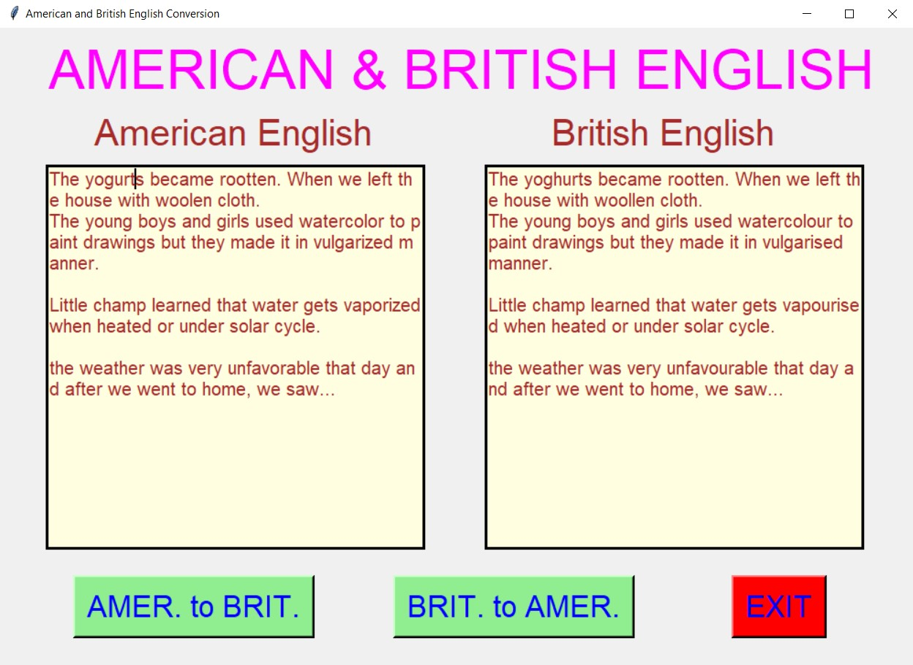
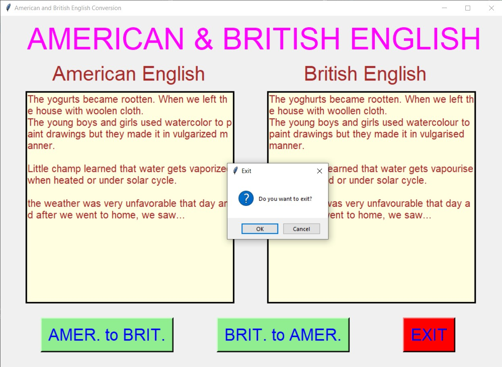

# ✔ AMERICAN & BRITISH ENGLISH CONVERSION
- ### A " American and British English Conversion" is an application created in python with tkinter gui.
- ### In this application, user will be able to convert any American text to British text or vice versa.
- ### for implementing this used json file from link loaded using requests library.

****

# REQUIREMENTS :
- ### python 3
- ### tkinter module
- ### from tkinter messagebox module
- ### from PIL import ImageTk, Image
- ### cv2
- ### requests

****

# How this Script works :
- ### User just need to download the file and run the american_and_british_english_conversion.py on their local system.
- ### Here user will be able to see the sample cheatsheet for basic conversion using CHEATSHEET button.
- ### Now on the main window of the application the user can click on the START button to get started with main application.
- ### ON the new window, user will be able to see two text area one for American text and other one for British text.
- ### Here user can enter any text in any text area and convert to another English using AMER. to BRIT. and BRIT. to AMER. button.
- ### Also there is an EXIT button, clicking on which exit dialog box appears asking for the permission of the user for closing the window.

# Purrpose :
- ### This scripts helps user to easily convert from American English to British English or vice versa.

# Compilation Steps :
- ### Install tkinter, cv2, requests
- ### After that download the code file, and run american_and_british_english_conversion.py on local system.
- ### Then the script will start running and user can explore it by entering the text in any one English and converting it to another English.

****

# SCREENSHOTS :

****

   
   
   
   
   
   
   
   

****

# Author :
- ### Akash Ramanand Rajak
