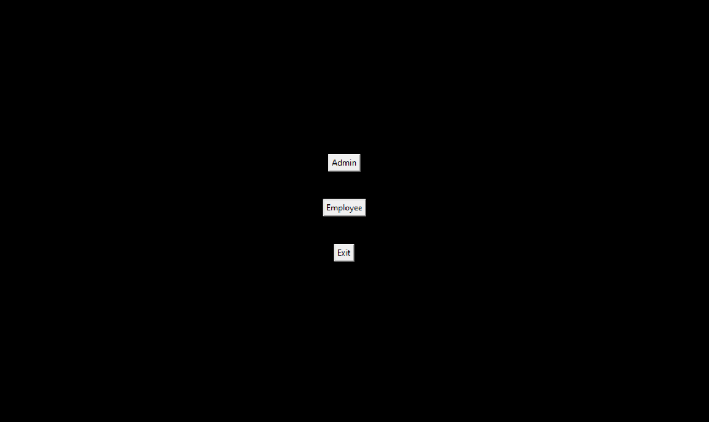
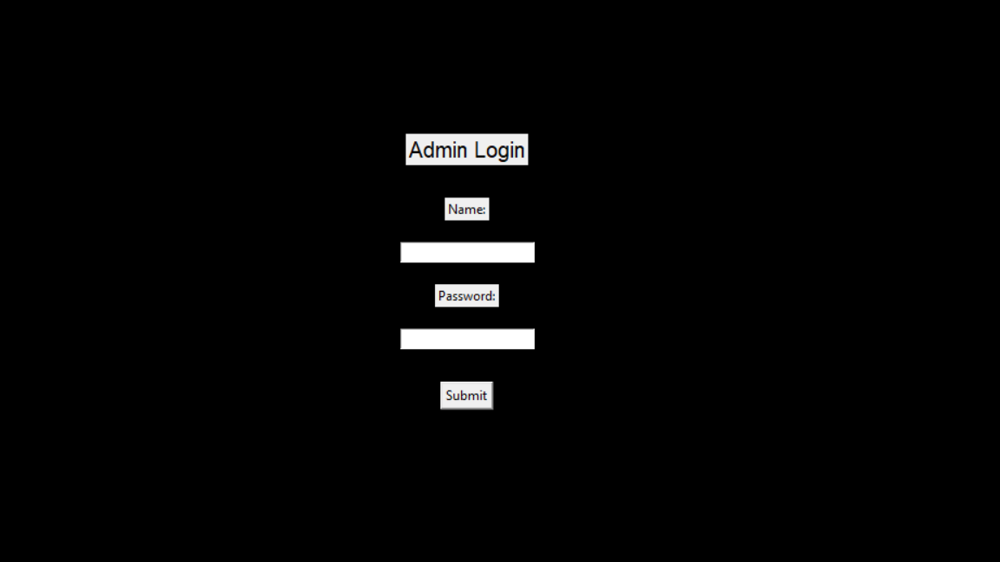
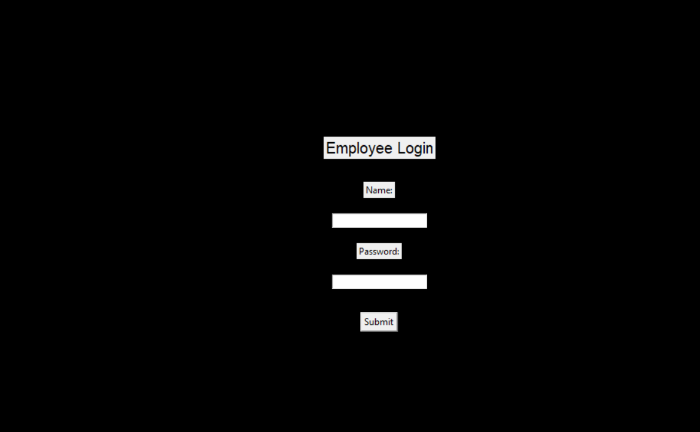

# Bank Management System
This is a data management system for the employee or staff of the Banks. 
Manager of Accountant can maintain the whole management system. 
It have two panel "Admin" and "Employee".

## 
## Requirements/Prerequisites
- [tkinter](https://docs.python.org/3/library/tkinter.html) (Graphical User Interface)
- [sqlite3](https://www.sqlite.org/download.html) (Database)
- [python](https://www.python.org/downloads/) >= 3.8
- [Pycharm editor](https://www.jetbrains.com/pycharm/download/#section=windows) (Best for python related projects)

## How to run?
- Setup the enviorment in Pycharm editor.
> pip install python

> pip install tkinter

then:
> py frontend.py
- Click on bankmanaging.db and Pycharm will automatically open it with sqlite3.

## Workflow of the Project
- ### Sqlite3 Database workflow/map

- ### Project Workflow
>
>* **Admin**
>    * login(Name and Password [check: gautam and 1103])
>        * New Employee (To add bank's employee data)
>        * Update details (To update details of employee)
>        * Show All Employee (To view all employee of bank and their details)
>        * Total Money (To see the total amount of money in bank)
>
> 
>* **Employee**
>    * login (Name and Password [check: jaiswal and 1103])
>        * Create Account (Create customers acoount using: Name, Age, Address, Balance, Account type, Mobile mumber)
>        * Show Details (Show details of customers)
>        * Add balance (Add balance in customers account using account number)
>        * Withdraw money (Withraw of amount from customers account)
>        * Check balance (Check the balance in customers account)
>        * Update account (Update/kyc of customers details)
>        * List of all members (See all the customers and their details)
>        * Delete account (Delete or Close the customers account)
>    

## Let's see some snaphots!
 

