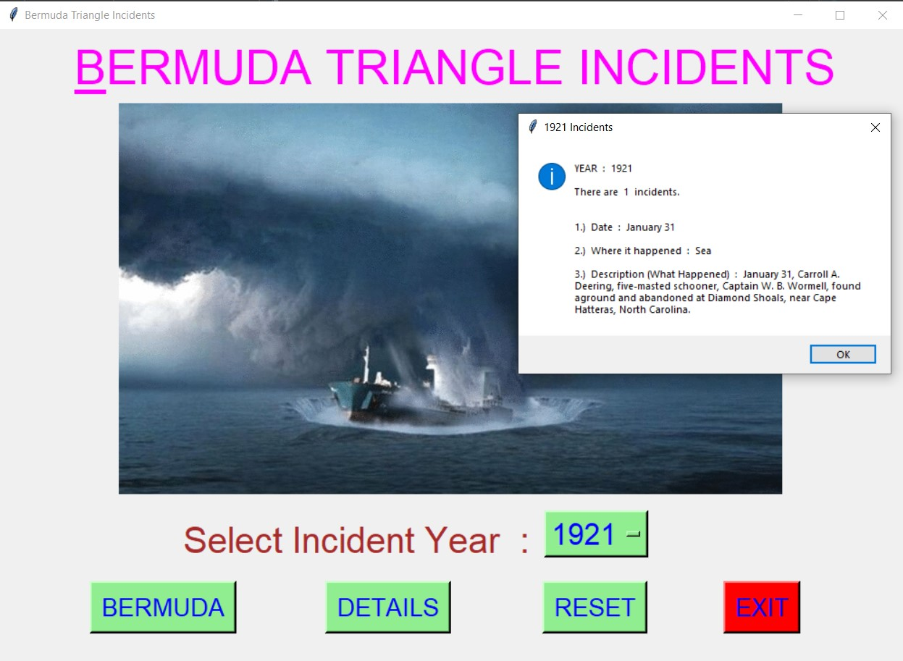
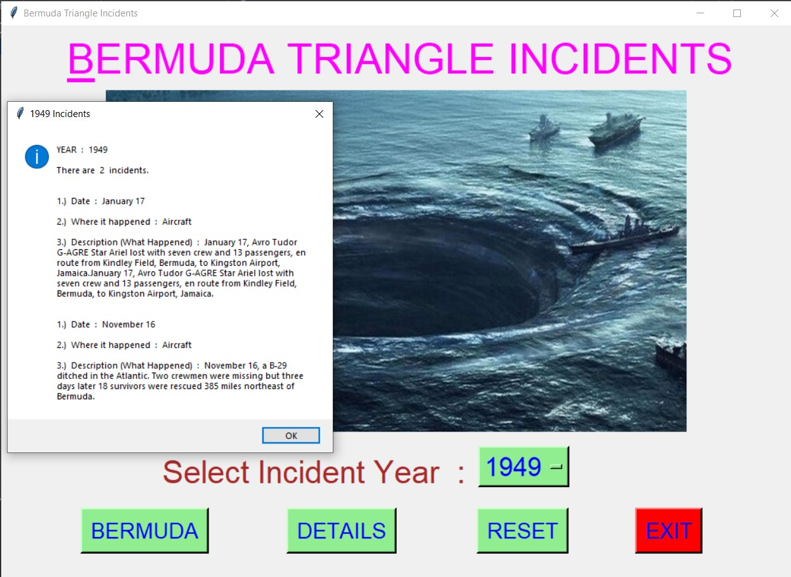
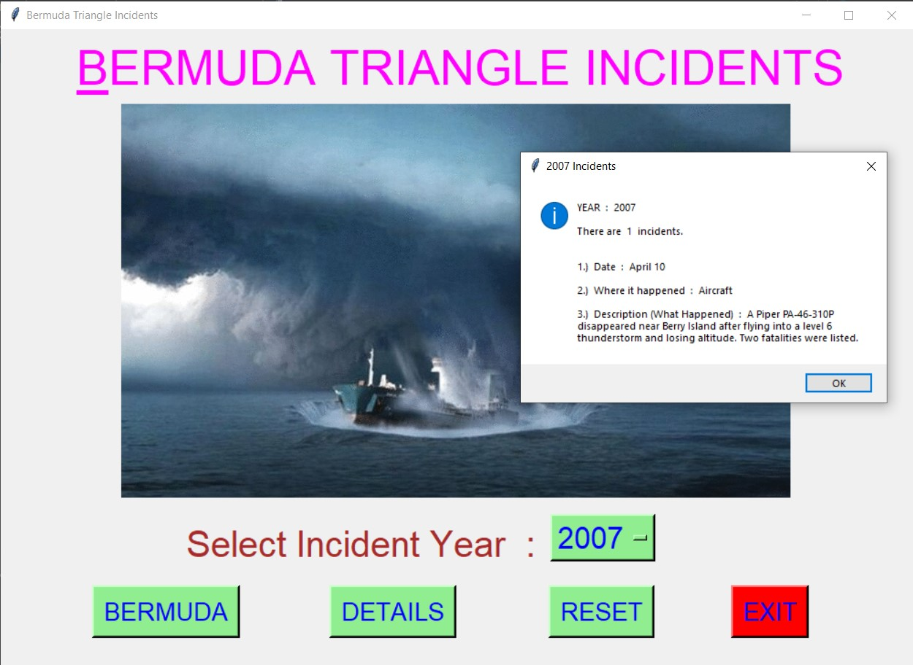
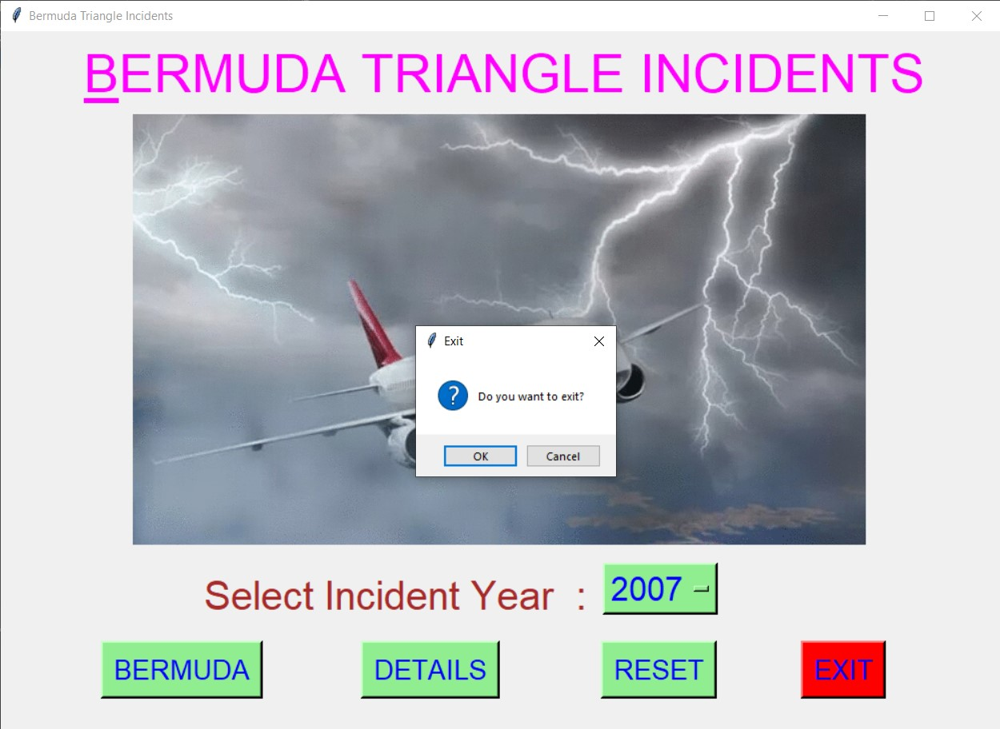

# ✔ BERMUDA TRIANGLES INCIDENTS
- ### A "Bermuda Triangle Incidents " is an application created in python with tkinter gui.
- ### In this application, user can find the details about all the Bermuda incident that took in past years.
- ### The information will be like on which date incident happened, where it happened, and what happened.
- ### for the data, used the bermuda_incidents.json data, and read loaded using json library.

****

# REQUIREMENTS :
- ### python 3
- ### tkinter module
- ### from tkinter messagebox module
- ### json

****

# How this Script works :
- ### User just need to download the file and run the bermuda_triangle_details.py on their local system.
- ### Now on the main window of the application the user needs to select the year from the drop down OptionMenu.
- ### After user has chosen the year, when user clicks on the BY DETAILS button, he/she will be able to see the count of incident that took place and for each incident get the details of three things, like on which date incident happened, where it happened, and what happened.
- ### Also there is a BERMUDA button, clicking on which shows what is Bermuda Triangle in brief.
- ### Also there is a reset button, clicking on which user can resets both the Option Menu to default year i.e. 1492.
- ### Also there is an exit button, clicking on which exit dialog box appears asking for the permission of the user for closing the window.

# Purpose :
- ### This scripts helps us to easily get interesting details all the past years Bermuda Triangle incidents.

# Compilation Steps :
- ### Install tkinter, json
- ### After that download the code file, and run bermuda_triangle_details.py on local system.
- ### Then the script will start running and user can explore all the past years Bermuda Incidents.

****

****

# SCREENSHOTS :

****

   
   
   
   
   
   
   
   

****

# Author :
- ### Akash Ramanand Rajak
