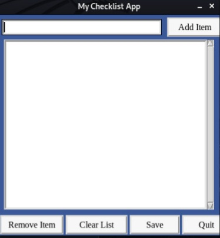

# Checklist App
# Aim 
To create a to do list app in python.

# Purpose 
Everyone can record  the tasks they wanna do or have done.
## Description 
* This app is used to maintain a todo list.
* You can add,delete and save the jobs that you want to do.
* If you want to do a task you can click on add item  button.
* If you want to delete an item select the item and click on remove item button.
* If you want to clear all items then click on clear list button.
* If you want to save your previous tasks you can click on save button.

## How to run it 
* Make Sure you have python in your machine.
* Also check for tkinter.
* Now you are all set to run this project.

# Screenshot

## Author
Siddhi Bhanushali 
